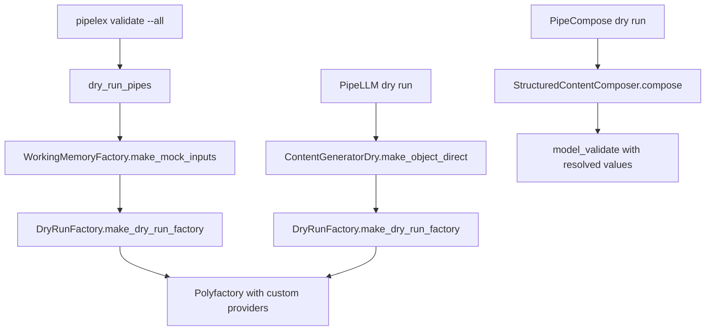

# Dry Run Mock Generation

Dry runs validate pipeline structure without executing inference. This requires generating mock `StuffContent` objects that satisfy Pydantic field constraints. The `DryRunFactory` system produces format-compliant mock values for fields with validation rules (e.g., snake_case identifiers, PascalCase concept codes).

---

## Why Mock Generation Matters

Pydantic models in Pipelex often enforce format constraints via `field_validator` or `model_validator`:

```python
class BundleHeaderSpec(StructuredContent):
    domain_code: str  # Must be snake_case
    main_pipe: str    # Must be snake_case, must exist in pipe dict

class ConceptSpec(StructuredContent):
    the_concept_code: str  # Must be PascalCase
```

Standard mock generators (like Polyfactory) produce random strings like `"uygNjiAuDMOtZEyibgHw"` which fail validation. The dry run system addresses this at two levels:

1. **Field-level**: Generate values matching expected formats (snake_case, PascalCase, concept refs, etc.)
2. **Model-level**: Bypass validators using `factory_use_construct=True`

---

## When Dry Run Mock Generation Is Used



| Trigger | Entry Point | Mock Generation |
|---------|-------------|-----------------|
| `pipelex validate` | `dry_run_pipe()` | `WorkingMemoryFactory.make_mock_inputs()` |
| `PipeLLM` output in dry mode | `ContentGeneratorDry.make_object_direct()` | `DryRunFactory` (auto-detects from field definitions) |
| `PipeFunc` output in dry mode | `WorkingMemoryFactory.make_mock_content()` | `DryRunFactory` (with explicit field constraints) |
| `PipeCompose` in dry mode | `StructuredContentComposer.compose()` | Uses resolved values from working memory (no mocks) |

---

## Architecture

### MockFormat Enum

Located at `pipelex/cogt/content_generation/dry_run_factory.py`, the `MockFormat` enum defines all supported mock value formats:

```python
class MockFormat(StrEnum):
    SNAKE_CASE = "snake_case"
    PASCAL_CASE = "pascal_case"
    CONCEPT_REF = "concept_ref"
    IGNORE = "ignore"
    DICT_SNAKE_KEY_PASCAL_VALUE = "dict_snake_key_pascal_value"
    DICT_SINGLE_EXTRACT_INPUT = "dict_single_extract_input"
```

### DryRunFactory

The factory dynamically creates a Polyfactory `ModelFactory` subclass with field-specific providers:

```python
class DryRunFactory:
    @classmethod
    def generate_snake_case_code(cls) -> str:
        suffix = "".join(random.choices(string.ascii_lowercase, k=4))
        return f"mock_{suffix}"  # e.g., "mock_abcd"

    @classmethod
    def generate_pascal_case_code(cls) -> str:
        suffix = "".join(random.choices(string.ascii_lowercase, k=4))
        return f"Mock{suffix.capitalize()}"  # e.g., "MockAbcd"

    @classmethod
    def generate_concept_ref(cls) -> str:
        return f"{cls.generate_snake_case_code()}.{cls.generate_pascal_case_code()}"
        # e.g., "mock_abcd.MockCdef"

    @classmethod
    def make_dry_run_factory(
        cls,
        object_class: type[BaseModelTypeVar],
        snake_case_field_names: set[str] | None = None,
        pascal_case_field_names: set[str] | None = None,
    ) -> type[ModelFactory[BaseModelTypeVar]]:
        ...
```

---

## Generated Mock Value Formats

| Format | Generator | Example Output | Used For |
|--------|-----------|----------------|----------|
| `SNAKE_CASE` | `generate_snake_case_code()` | `mock_abcd` | `domain_code`, `pipe_code`, `the_field_name` |
| `PASCAL_CASE` | `generate_pascal_case_code()` | `MockAbcd` | `the_concept_code` |
| `CONCEPT_REF` | `generate_concept_ref()` | `mock_abcd.MockCdef` | `concept_ref` field (domain.ConceptCode format) |
| `IGNORE` | Sets field to `Ignore()` | None/default | `default_value`, `structure` fields |
| `DICT_SNAKE_KEY_PASCAL_VALUE` | `generate_dict_snake_key_pascal_value()` | `{mock_abcd: MockCdef}` | `inputs` dict in PipeSpec |
| `DICT_SINGLE_EXTRACT_INPUT` | `generate_dict_single_extract_input()` | `{mock_abcd: "Image"}` | `inputs` dict in PipeExtract |
| Random string | Polyfactory default | `uygNjiAuDMOtZEyibgHw` | All other string fields |

---

## Declaring MockFormat on Fields

The `DryRunFactory` auto-detects format constraints from Pydantic `Field` definitions using the `mock_format` key in `json_schema_extra`:

```python
from pydantic import Field
from pipelex.cogt.content_generation.dry_run_factory import MockFormat

class ConceptStructureSpec(StructuredContent):
    # Snake case field
    the_field_name: str = Field(
        description="Field name. Must be snake_case.",
        json_schema_extra={"mock_format": MockFormat.SNAKE_CASE}
    )

    # Concept reference field (domain.ConceptCode format)
    concept_ref: str | None = Field(
        default=None,
        description="For type='concept', the concept reference.",
        json_schema_extra={"mock_format": MockFormat.CONCEPT_REF},
    )

    # Field to ignore during mock generation (use default/None)
    default_value: Any | None = Field(
        default=None,
        json_schema_extra={"mock_format": MockFormat.IGNORE}
    )
```

---

## Using Field Examples for Enum-like Values

For fields that should pick from a set of valid values (like enum members or known strings), use the `examples` parameter. The factory's `__use_examples__: True` configuration makes Polyfactory randomly select from provided examples:

```python
class ConceptSpec(StructuredContent):
    # Refines should be one of the native concepts
    refines: str | None = Field(
        default=None,
        examples=["Text", "Image", "Document", "TextAndImages", "Number", "Page"],
    )

class PipeSpec(StructuredContent):
    # Extract talent should be a valid ExtractTalent value
    extract_talent: ExtractTalent | str = Field(
        description="Select extraction model talent",
        examples=list(ExtractTalent),  # Polyfactory picks randomly from these
    )
```

---

## Cross-Field Dependencies with PostGenerated

For fields that depend on values generated for other fields, use Polyfactory's `PostGenerated` directive. The factory automatically handles the `main_pipe` field which must reference a key from the generated `pipe` dict:

```python
# Inside DryRunFactory.make_dry_run_factory():
if "main_pipe" in object_class.model_fields and "pipe" in object_class.model_fields:
    class_attrs["main_pipe"] = PostGenerated(cls._main_pipe_from_pipe_dict)
```

The callback receives all previously generated values and can compute the dependent field:

```python
@staticmethod
def _main_pipe_from_pipe_dict(_field_name: str, values: dict[str, Any]) -> str:
    pipe_dict: dict[str, Any] | None = values.get("pipe")
    if pipe_dict and len(pipe_dict) > 0:
        pipe_keys: list[str] = list(pipe_dict.keys())
        return random.choice(pipe_keys)
    # Fallback to a mock value if pipe dict is empty/not available
    return "mock_" + "".join(random.choices(string.ascii_lowercase, k=4))
```

---

## Implementation Details

### Mock Input Generation

When `WorkingMemoryFactory.make_mock_inputs()` creates mock working memory:

```python
@classmethod
def make_mock_content(cls, typed_named_stuff_spec: TypedNamedStuffSpec) -> StuffContent:
    mock_factory = DryRunFactory.make_dry_run_factory(
        object_class=typed_named_stuff_spec.structure_class,
        snake_case_field_names=SNAKE_CASE_FIELD_NAMES,
        pascal_case_field_names=PASCAL_CASE_FIELD_NAMES,
    )
    return mock_factory.build(factory_use_construct=True)
```

The `factory_use_construct=True` flag bypasses `field_validator` and `model_validator` during object creation, preventing validation errors from random nested values.

### LLM Output Generation

When `ContentGeneratorDry.make_object_direct()` generates mock LLM outputs:

```python
object_factory = DryRunFactory.make_dry_run_factory(object_class)
return object_factory.build(factory_use_construct=True)
```

No explicit field constraints are passed—the factory auto-detects `MockFormat` from field definitions.

### PipeCompose Resolution

`StructuredContentComposer.compose()` does **not** generate mocks. Instead, it resolves field values from working memory and validates the result:

```python
async def compose(self) -> StuffContent:
    field_values = await self._resolve_all_fields()
    try:
        return self.output_class.model_validate(field_values)
    except ValidationError as exc:
        formatted_error = format_pydantic_validation_error(exc)
        msg = f"Cannot validate {self.output_class.__name__}: {formatted_error}"
        raise StructuredContentComposerValidationError(msg) from exc
```

In dry run mode, the working memory already contains properly formatted mock values (generated by `WorkingMemoryFactory`), so validation typically succeeds.

---

## Behavior Matrix

| Scenario | Format Constraints | Validators Bypassed |
|----------|-------------------|---------------------|
| `WorkingMemoryFactory.make_mock_content()` | Yes (from `json_schema_extra` + explicit params) | Yes (`factory_use_construct`) |
| `ContentGeneratorDry.make_object_direct()` | Yes (from `json_schema_extra` only) | Yes (`factory_use_construct`) |
| `StructuredContentComposer.compose()` | N/A (uses resolved values) | No (validates) |

---

## Extending Field Constraints

### Adding a New MockFormat Value

1. **Add to the MockFormat enum** in `dry_run_factory.py`:

    ```python
    class MockFormat(StrEnum):
        ...
        KEBAB_CASE = "kebab_case"
    ```

2. **Add a generator method**:

    ```python
    @classmethod
    def generate_kebab_case_code(cls) -> str:
        suffix = "".join(random.choices(string.ascii_lowercase, k=4))
        return f"mock-{suffix}"
    ```

3. **Handle the format in `make_dry_run_factory()`**:

    ```python
    for field_name in detected_formats[MockFormat.KEBAB_CASE]:
        if field_name in object_class.model_fields:
            class_attrs[field_name] = Use(cls.generate_kebab_case_code)
    ```

### Using the New Format on Fields

```python
class MySpec(StructuredContent):
    my_kebab_field: str = Field(
        description="A kebab-case identifier",
        json_schema_extra={"mock_format": MockFormat.KEBAB_CASE}
    )
```

!!! warning "Field name matching is exact"
    The field name must exactly match a key in `object_class.model_fields`. No glob patterns or inheritance traversal.

---

## File Reference

| File | Purpose |
|------|---------|
| `pipelex/cogt/content_generation/dry_run_factory.py` | `DryRunFactory` class with `MockFormat` enum and generators |
| `pipelex/cogt/content_generation/content_generator_dry.py` | `ContentGeneratorDry` for mock LLM/image outputs |
| `pipelex/core/memory/working_memory_factory.py` | `WorkingMemoryFactory.make_mock_content()` with field constraints |
| `pipelex/pipe_operators/compose/structured_content_composer.py` | Composes `StructuredContent` from working memory (no mocks) |
| `pipelex/pipe_run/dry_run.py` | `dry_run_pipe()` orchestration |

---

## Next Steps

- [Architecture Overview](./architecture-overview.md) — Understand the two-layer design
- [Test Profile Configuration](./test-profile-configuration.md) — Configure model sets for testing
