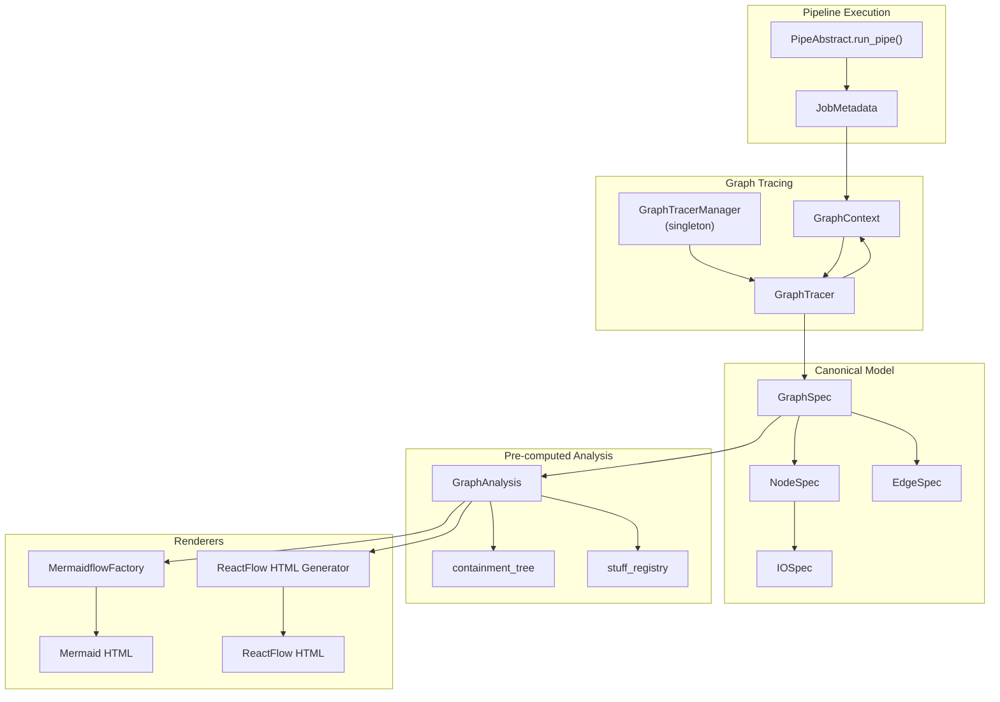

# Execution Graph Tracing

Pipelex captures pipeline executions as directed graphs for visualization and debugging. The `pipelex/graph/` module provides tracing infrastructure, a canonical data model (GraphSpec), and multiple rendering backends (Mermaid, ReactFlow).

---

## Design Principle

Pipeline executions form implicit graphs: pipes call other pipes, data flows between them. The graph module makes this structure explicit:

1. **Trace at runtime**: Instrument pipe execution to capture nodes (pipes) and edges (relationships)
2. **Store canonically**: GraphSpec is a versioned, renderer-agnostic JSON model
3. **Render as needed**: Transform GraphSpec into Mermaid diagrams or ReactFlow visualizations

```
Pipe Execution → GraphTracer → GraphSpec → Renderers → HTML/Mermaid
```

!!! info "Non-Intrusive Design"
    Graph tracing is opt-in. When disabled, a no-op tracer is used with zero overhead. The tracer is injected via `GraphContext` in `JobMetadata`, not global state.

---

## Usage Variants

| Scenario | CLI | API | Result |
|----------|-----|-----|--------|
| Generate execution graph | `pipelex run pipe my_pipe --graph` | `PipelexRunner(execution_config=...).execute_pipeline(...)` | GraphSpec JSON + HTML viewers |
| Force include full data | `--graph --graph-full-data` | `data_inclusion.stuff_json_content=True` | Data embedded in IOSpec |
| Force exclude data | `--graph --graph-no-data` | All `data_inclusion.*=False` | Previews only |
| Dry run with graph | `--dry-run --graph` | `dry_run_pipe_with_graph(pipe)` | Graph of mock execution |

!!! info "Full Data Included by Default"
    The default configuration includes full data in graphs (`stuff_json_content`, `stuff_text_content`, `stuff_html_content`, and `error_stack_traces` are all `true`). Use `--graph-full-data` or `--graph-no-data` only to override project-specific settings.

---

## Interfaces

### CLI Commands

```bash
# Run pipeline and generate graph
pipelex run pipe my_pipe --graph

# Include full serialized data
pipelex run pipe my_pipe --graph --graph-full-data

# Exclude data (previews only)
pipelex run pipe my_pipe --graph --graph-no-data

# Dry run with graph tracing
pipelex run pipe my_pipe --dry-run --graph --mock-inputs
```

### API

```python
from pipelex.pipeline.runner import PipelexRunner
from pipelex.pipe_run.dry_run_with_graph import dry_run_pipe_with_graph

# Execute with graph tracing via config
runner = PipelexRunner(
    execution_config=config.with_graph_config_overrides(generate_graph=True),
)
response = await runner.execute_pipeline(
    pipe_code="my_pipe",
)
pipe_output = response.pipe_output

# Dry run directly returns GraphSpec
graph_spec = await dry_run_pipe_with_graph(pipe)
```

### Outputs

| Output | File | Purpose |
|--------|------|---------|
| `graphspec_json` | `_graphspec.json` | Canonical graph representation |
| `mermaidflow_mmd` | `_mermaid.mmd` | Mermaid flowchart code |
| `mermaidflow_html` | `_mermaid.html` | Standalone Mermaid viewer |
| `reactflow_html` | `_reactflow.html` | Interactive ReactFlow viewer |

---

## Architecture



---

## Core Components

### GraphSpec

The canonical, versioned data model for execution graphs. Designed for JSON serialization and renderer-agnostic storage.

```python
class GraphSpec(BaseModel):
    graph_id: str
    created_at: datetime
    pipeline_ref: PipelineRef
    nodes: list[NodeSpec]
    edges: list[EdgeSpec]
    meta: dict[str, Any]

    def to_json(self) -> str:
        return self.model_dump_json(by_alias=True, indent=2)
```

### Node Types

| NodeKind | Description |
|----------|-------------|
| `PIPE_CALL` | Generic pipe invocation |
| `CONTROLLER` | PipeController (Sequence, Parallel, etc.) |
| `OPERATOR` | PipeOperator (LLM, Extract, etc.) |
| `INPUT` | Pipeline input node |
| `OUTPUT` | Pipeline output node |
| `ARTIFACT` | Generated artifact |
| `ERROR` | Error node |

### Edge Types

| EdgeKind | Description |
|----------|-------------|
| `CONTROL` | Execution flow between pipes |
| `DATA` | Data flow (stuff passed between pipes) |
| `CONTAINS` | Parent-child containment (controller → children) |
| `SELECTED_OUTCOME` | Condition outcome selection |

### Node Status

| NodeStatus | Description |
|------------|-------------|
| `SCHEDULED` | Not yet started |
| `RUNNING` | Currently executing |
| `SUCCEEDED` | Completed successfully |
| `FAILED` | Execution failed |
| `SKIPPED` | Skipped during execution |
| `CANCELED` | Canceled before completion |

---

## Implementation

### Tracing Flow

```python
# 1. Manager opens tracer for pipeline run
manager = GraphTracerManager.get_or_create_instance()
graph_context = manager.open_tracer(
    graph_id=pipeline_run_id,
    data_inclusion=config.data_inclusion,
    pipeline_ref_domain="my_domain",
    pipeline_ref_main_pipe="my_pipe",
)

# 2. Context flows through JobMetadata to each pipe
job_metadata = JobMetadata(
    pipeline_run_id=pipeline_run_id,
    graph_context=graph_context,
)

# 3. Each pipe reports start/end to tracer
node_id, child_context = manager.on_pipe_start(
    graph_context=graph_context,
    pipe_code="extract_text",
    pipe_type="PipeExtract",
    node_kind=NodeKind.OPERATOR,
    started_at=datetime.now(timezone.utc),
    input_specs=[...],
)

# 4. On completion, report success with output
manager.on_pipe_end_success(
    graph_id=graph_context.graph_id,
    node_id=node_id,
    ended_at=datetime.now(timezone.utc),
    output_spec=IOSpec(...),
)

# 5. Manager closes tracer and returns GraphSpec
graph_spec = manager.close_tracer(pipeline_run_id)
```

### GraphContext Propagation

GraphContext is a serializable context that flows through pipe execution:

```python
class GraphContext(BaseModel):
    graph_id: str                           # Unique graph identifier
    parent_node_id: str | None              # Parent pipe's node ID
    node_sequence: int                      # Counter for generating node IDs
    data_inclusion: DataInclusionConfig     # What data to capture

    def copy_for_child(self, child_node_id: str, next_sequence: int) -> GraphContext:
        """Create context for nested pipe execution."""
        return GraphContext(
            graph_id=self.graph_id,
            parent_node_id=child_node_id,
            node_sequence=next_sequence,
            data_inclusion=self.data_inclusion,
        )
```

### Producer/Consumer Paradigm

Data flow in the graph follows a producer/consumer model:

- **Producers**: Nodes that create or output data (stuff). When a pipe outputs a value, it becomes the producer of that data item.
- **Consumers**: Nodes that receive or use data as input. When a pipe takes a value as input, it becomes a consumer of that data item.

Each piece of data is identified by a **digest** (a unique hash). This allows the tracer to track where data originates and where it flows, even when the same value passes through multiple pipes.

```
Producer Node ──(outputs)──► Stuff (digest: abc123) ──(inputs)──► Consumer Node
```

This paradigm enables:

- Automatic DATA edge generation without explicit wiring
- Visualization of data lineage across the execution graph
- Debugging by tracing which pipe produced unexpected output

### Data Flow Edge Generation

DATA edges are generated at teardown by correlating input/output digests:

```python
def _generate_data_edges(self) -> None:
    for consumer_node_id, node_data in self._nodes.items():
        for input_spec in node_data.input_specs:
            if input_spec.digest is None:
                continue
            producer_node_id = self._stuff_producer_map.get(input_spec.digest)
            if producer_node_id and producer_node_id != consumer_node_id:
                self.add_edge(
                    source_node_id=producer_node_id,
                    target_node_id=consumer_node_id,
                    edge_kind=EdgeKind.DATA,
                    label=input_spec.name,
                )
```

---

## GraphAnalysis

Pre-computed analysis layer that extracts common information for renderers:

```python
analysis = GraphAnalysis.from_graphspec(graph_spec)

# Lookups
node = analysis.nodes_by_id["node_123"]
children = analysis.get_children("controller_node")
is_root = analysis.is_root("node_123")

# Data flow
stuff_info = analysis.get_stuff_info(digest="abc123")
producer = analysis.get_producer(digest="abc123")
consumers = analysis.get_consumers(digest="abc123")
```

| Attribute | Purpose |
|-----------|---------|
| `nodes_by_id` | Fast node lookup by ID |
| `containment_tree` | Parent → children mapping |
| `child_node_ids` | All nodes that have parents |
| `controller_node_ids` | Nodes with children |
| `root_nodes` | Top-level nodes |
| `stuff_registry` | Digest → StuffInfo |
| `stuff_producers` | Digest → producer node ID |
| `stuff_consumers` | Digest → consumer node IDs |

---

## Rendering

### Mermaidflow

Converts GraphSpec to Mermaid flowchart syntax with controller subgraphs:

```python
from pipelex.graph.mermaidflow.mermaidflow_factory import MermaidflowFactory

mermaidflow = MermaidflowFactory.make_from_graphspec(
    graph_spec,
    graph_config,
    direction=FlowchartDirection.TOP_DOWN,
    include_subgraphs=True,
)

print(mermaidflow.mermaid_code)
```

**Output structure:**

- Controllers rendered as subgraphs
- Operators rendered as rectangles inside subgraphs
- Stuff nodes (data items) rendered as stadium shapes
- DATA edges connect producers → stuff → consumers

### ReactFlow HTML

ReactFlow HTML is generated directly from GraphSpec — no intermediate ViewSpec layer. The HTML generator embeds GraphSpec as JSON and the client-side JavaScript handles dataflow analysis, layout, and rendering.

---

## Configuration

### GraphConfig

```toml
# pipelex.toml (default values)
[pipelex.pipeline_execution_config.graph_config]

[pipelex.pipeline_execution_config.graph_config.data_inclusion]
stuff_json_content = true       # Include full serialized data
stuff_text_content = true       # Include ASCII text representation
stuff_html_content = true       # Include HTML representation
error_stack_traces = true       # Include full stack traces

[pipelex.pipeline_execution_config.graph_config.graphs_inclusion]
graphspec_json = true           # Generate GraphSpec JSON
mermaidflow_mmd = true          # Generate Mermaid code
mermaidflow_html = true         # Generate Mermaid HTML
reactflow_html = true           # Generate ReactFlow HTML
```

### MermaidRenderingConfig

| Option | Description |
|--------|-------------|
| `direction` | Flowchart direction (TB, LR, BT, RL) |
| `is_include_data_edges` | Show data flow edges |
| `is_include_contains_edges` | Show containment edges |
| `is_show_stuff_codes` | Show digest in stuff labels |
| `style.theme` | Mermaid theme (default, dark, forest, neutral) |

### ReactFlowRenderingConfig

| Option | Description |
|--------|-------------|
| `layout_direction` | Dagre layout direction (TB, LR) |
| `nodesep` | Node separation in pixels |
| `ranksep` | Rank separation in pixels |
| `edge_type` | Edge style (bezier, smoothstep, step, straight) |
| `initial_zoom` | Initial viewport zoom |
| `style.theme` | UI theme (light, dark, system) |

---

## IOSpec Data Capture

IOSpec captures input/output data for nodes:

```python
class IOSpec(BaseModel):
    name: str                    # Variable name
    concept: str | None          # Concept code
    content_type: str | None     # MIME type
    preview: str | None          # Truncated preview (max 200 chars)
    size: int | None             # Content size
    digest: str | None           # Unique identifier for data flow
    data: Any | None             # Full serialized content
    data_text: str | None        # ASCII text representation
    data_html: str | None        # HTML representation
```

!!! warning "Preview Truncation"
    Previews are automatically truncated to 200 characters. Stack traces are truncated to 2000 characters. Use `--graph-full-data` to capture complete content.

---

## Validation

GraphSpec validation enforces invariants:

```python
from pipelex.graph.validation import validate_graphspec

validate_graphspec(graph_spec)
```

| Invariant | Error |
|-----------|-------|
| Duplicate node IDs | `GraphSpecValidationError` |
| Duplicate edge IDs | `GraphSpecValidationError` |
| Edge references non-existent node | `GraphSpecValidationError` |
| Failed node without error spec | `GraphSpecValidationError` |

---

## Syntax Quick Reference

| Pattern | Purpose |
|---------|---------|
| `GraphSpec.to_json()` | Serialize to JSON string |
| `GraphAnalysis.from_graphspec(g)` | Pre-compute analysis |
| `MermaidflowFactory.make_from_graphspec(...)` | Generate Mermaid |
| `generate_reactflow_html(graphspec, config)` | Generate ReactFlow HTML |
| `generate_graph_outputs(g, config, pipe_code)` | Generate all outputs |

---

## Files Reference

| File | Purpose |
|------|---------|
| `pipelex/graph/graphspec.py` | Canonical GraphSpec model |
| `pipelex/graph/graph_tracer.py` | GraphTracer implementation |
| `pipelex/graph/graph_tracer_manager.py` | Singleton manager for tracers |
| `pipelex/graph/graph_tracer_protocol.py` | Protocol + NoOp implementation |
| `pipelex/graph/graph_context.py` | Serializable tracing context |
| `pipelex/graph/graph_analysis.py` | Pre-computed graph analysis |
| `pipelex/graph/graph_factory.py` | Output generation factory |
| `pipelex/graph/graph_config.py` | Configuration models |
| `pipelex/graph/validation.py` | GraphSpec validation |
| `pipelex/graph/exceptions.py` | Graph-specific exceptions |
| `pipelex/graph/mermaidflow/` | Mermaid rendering |
| `pipelex/graph/reactflow/` | ReactFlow rendering |

---

## Next Steps

- [:material-sitemap: Architecture Overview](./architecture-overview.md){ .md-button .md-button--primary }
- [:material-image-multiple: Image Handling in LLM Prompts](./image-handling-in-llm-prompts.md){ .md-button }
