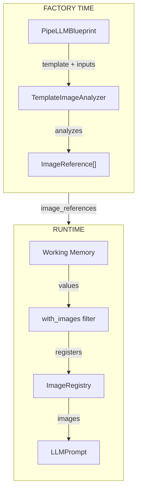
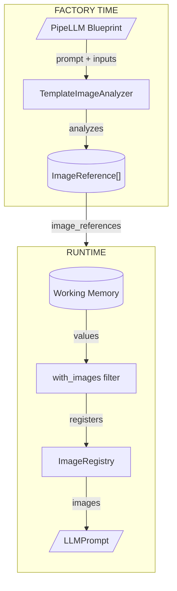

# Image Handling in LLM Prompts

This document describes how Pipelex handles images in PipeLLM prompts. The system implements a **prompt template-driven inclusion model** where images are sent to the LLM if and only if the prompt templates explicitly reference them.

Both `prompt` (user prompt) and `system_prompt` support image references using the same syntax.

---

## Design Principle

Images are included based on **what the prompt template references**, not on **what the input types contain**.

| Scenario | Images Sent? |
|----------|-------------|
| Input is `Image`, prompt template uses `@image` or `$image` | Yes |
| Input is `Page` with nested images, prompt template uses `@page` or `$page` | No |
| Input is `Page` with nested images, prompt template uses `{{ page \| with_images }}` | Yes |

This design prevents accidental image leakage and gives prompt template authors explicit control over what visual content reaches the LLM.

!!! info "Why Prompt Template-Driven?"
    Sending images to LLMs costs tokens and processing time. Prompt template-driven inclusion ensures you only pay for images you actually need the LLM to see.

---

## Three Reference Kinds

The system recognizes three distinct ways images can be referenced in prompt templates:

```
ImageReferenceKind
├── DIRECT       → Variable is ImageContent itself
├── DIRECT_LIST  → Variable is list[ImageContent] or Image[]
└── NESTED       → Variable is struct with nested images, using | with_images filter
```

### DIRECT References

When a prompt template variable directly points to an `Image` type:

```toml
[pipe.describe_photo]
inputs = { photo = "Image" }
prompt = "Describe this photo: @photo"
```

The image is automatically included. The `@photo` (or `$photo`) reference renders as `[Image 1]` in the prompt text.

### DIRECT_LIST References

When a prompt template variable points to an `Image[]` (list of images):

```toml
[pipe.analyze_gallery]
inputs = { photos = "Image[]" }
prompt = "Analyze these photos: $photos"
```

All images in the list are included. The `$photos` (or `@photos`) reference renders as:
```
[Image 1]
[Image 2]
[Image 3]
```

### NESTED References

When a struct contains images but isn't itself an image type, you must explicitly request image extraction:

```toml
[pipe.describe_document]
inputs = { doc = "Document" }
prompt = "{{ doc | with_images }}"
```

Without `| with_images`, only the text representation is sent. With it, nested images are extracted and included.

---

## System Prompt Support

Images can be referenced in both `system_prompt` and `prompt` using identical syntax:

```toml
[pipe.analyze_with_context]
inputs = { context_image = "Image", query_image = "Image" }
system_prompt = "You are analyzing images. Here is context: $context_image"
prompt = "Now analyze this image: $query_image"
```

### Global Numbering

When images appear in both prompts, they share a **global sequential numbering**:

1. **System prompt images are extracted first** - they get lower numbers (`[Image 1]`, `[Image 2]`, etc.)
2. **User prompt images are extracted second** - they continue the sequence (`[Image 3]`, `[Image 4]`, etc.)

This ensures consistent numbering across the entire prompt sent to the LLM.

### Example

```toml
[pipe.compare_styles]
inputs = { reference = "Image", subject = "Image" }
system_prompt = "Use this reference image for style comparison: $reference"
prompt = "Analyze the style of this image: $subject"
```

Results in:

- System prompt: `"Use this reference image for style comparison: [Image 1]"`
- User prompt: `"Analyze the style of this image: [Image 2]"`

Both images are sent to the LLM in order: `[Image 1]` (reference), `[Image 2]` (subject).

---

## The `| with_images` Filter

The `with_images` filter is the key mechanism for extracting images from complex structures.

### What It Does

1. Walks the structure recursively
2. Finds all `ImageContent` instances
3. Registers each image with a sequential number
4. Returns the text representation with `[Image N]` tokens inline

### Example Output

Given a `Page` with text and images:

```python
PageContent(
    text_and_images=TextAndImagesContent(
        text=TextContent(text="Welcome to the guide"),
        images=[ImageContent(url="...")]
    ),
    page_view=ImageContent(url="...")
)
```

The filter produces:

```
text_and_images:
  text: Welcome to the guide
  images: [Image 1]
page_view: [Image 2]
```

### When to Use It

| Structure | Without Filter | With Filter |
|-----------|---------------|-------------|
| `Page` | Text only | Text + images |
| `Document` | Text only | Text + images |
| `list[Article]` | Text only | Text + all nested images |
| Custom struct with images | Text only | Text + images |

---

## Architecture

### Component Overview



### Factory Time: Prompt Template Analysis

When a PipeLLM is created from a blueprint, the `TemplateImageAnalyzer` examines both `prompt` and `system_prompt` templates:

1. **Parse prompt template AST** - Extract all variable references with their filters
2. **Resolve types** - Look up each variable's type from input specifications
3. **Determine reference kind** - Based on type and filters applied
4. **Pre-compute nested paths** - For NESTED references, identify where images live in the structure

```python
# Stored in PipeLLM after analysis
user_image_references = [
    ImageReference(
        variable_path="page",
        kind=ImageReferenceKind.NESTED,
        nested_image_paths=["text_and_images.images", "page_view"]
    )
]
system_image_references = [
    ImageReference(
        variable_path="context_image",
        kind=ImageReferenceKind.DIRECT,
        nested_image_paths=None
    )
]
```

### Runtime: Image Collection

When the prompt is built:

1. **Create registry** - Fresh `ImageRegistry` for this prompt
2. **Extract system prompt images first** - Direct and list references from `system_prompt` are processed first, getting lower numbers
3. **Extract user prompt images second** - Direct and list references from `prompt` continue the numbering sequence
4. **Inject registry into context** - Registry available to Jinja2 filters for nested image extraction
5. **Render both templates** - `with_images` filter populates registry during rendering
6. **Collect images** - Retrieve all registered images after rendering
7. **Build prompt** - Both texts have tokens, images in separate list

---

## Data Flow



**Factory Time**: The `TemplateImageAnalyzer` parses both `system_prompt` and `prompt` templates, finds variables with image types or the `| with_images` filter, looks up their types, and pre-computes nested image paths.

**Runtime**: System prompt images are extracted first, then user prompt images, ensuring global sequential numbering. Values with nested images are passed through the `with_images` filter, which registers images to the `ImageRegistry` and returns text with `[Image N]` tokens. The final `LLMPrompt` contains both texts and the collected images.

---

## Image Registry

The `ImageRegistry` manages image numbering during prompt construction.

### Key Properties

- **1-indexed** - Numbers start at 1 for readability
- **Sequential** - Images numbered in order of registration
- **Deduplicated** - Same URL gets same number

```python
class ImageRegistry:
    def register_image(self, image: ImageContent) -> int:
        """Returns image number. Same URL = same number."""
        if image.url in self._url_to_number:
            return self._url_to_number[image.url]

        number = len(self._images) + 1
        self._images.append(image)
        self._url_to_number[image.url] = number
        return number
```

### Deduplication Example

If the same image appears in multiple places:

```python
# First registration
registry.register_image(img_a)  # Returns 1

# Second registration of same URL
registry.register_image(img_a)  # Returns 1 (not 2)

# Different image
registry.register_image(img_b)  # Returns 2
```

---

## Working with StuffArtefact

Values from working memory arrive wrapped in `StuffArtefact`, a thin delegation adapter that provides template-friendly access to content fields.

### Template Access

StuffArtefact delegates attribute access to the underlying content:

```python
# In template: {{ page.title }}
# StuffArtefact delegates to: page._stuff.content.title
```

### Filter Handling

The `with_images` filter uses the `ImageRenderable` protocol to handle StuffArtefact transparently:

```python
# StuffArtefact implements ImageRenderable
if isinstance(value, ImageRenderable):
    return value.render_with_images(registry, text_format)

# StuffArtefact.render_with_images() delegates to content
def render_with_images(self, registry, text_format) -> str:
    return self._stuff.content.render_with_images(registry, text_format)
```

!!! note "ImageRenderable Protocol"
    The `ImageRenderable` protocol uses `@runtime_checkable` to enable `isinstance()` checks without importing concrete types—avoiding circular imports between the Jinja2 layer and domain layer.

For detailed information on StuffArtefact's delegation pattern and the ImageRenderable protocol, see [:material-code-braces: StuffArtefact & Image Rendering](./stuffartefact-and-image-rendering.md).

---

## Validation

The system validates image usage at both factory time and runtime:

### Factory Time

| Condition | Error |
|-----------|-------|
| `\| with_images` on `Image` type | "Cannot use with_images on direct Image" |
| `\| with_images` on type with no nested images | "Type X has no nested image fields" |

### Runtime

| Condition | Error |
|-----------|-------|
| `with_images` on undefined value | "Cannot use with_images filter on undefined value" |
| `with_images` on non-ImageRenderable type (e.g., string) | "X does not implement the ImageRenderable protocol" |

The runtime check catches cases where filter chaining converts structured data to a string before `with_images` runs (e.g., `{{ pages | tag | with_images }}`).

---

## Prompt Template Syntax Reference

### Direct Image

```toml
inputs = { photo = "Image" }
prompt = "$photo"
```

### Image List

```toml
inputs = { gallery = "Image[]" }
prompt = "$gallery"
```

### Multiple Image Lists

```toml
inputs = { before = "Image[]", after = "Image[]" }
prompt = """
Before: $before

After: $after
"""
```

### Nested Images

```toml
inputs = { report = "Report" }
prompt = "{{ report | with_images }}"
```

### Mixed

```toml
inputs = { cover = "Image", pages = "Page[]" }
prompt = """
Cover: $cover

Pages:
{{ pages | with_images }}
"""
```

!!! warning "Filter Chaining: Order Matters"
    The `with_images` filter extracts images from structured data and returns a string with `[Image N]` tokens. The `tag` filter wraps its input in tags (```...``` or XML). **Order matters** when chaining these filters.

    **What works:**

    - ✅ `{{ pages | with_images }}` - extracts images with tokens
    - ✅ `{{ pages | tag }}` - formats text output (no images)
    - ✅ `{{ pages | with_images | tag }}` - extracts images, then wraps result in tags
    - ✅ `{{ pages | first | with_images }}` - non-terminal filter before `with_images` is fine

    **What doesn't work:**

    - ❌ `{{ pages | tag | with_images }}` - `tag` stringifies first, so `with_images` receives a string and can't extract images

    **Rule of thumb:** `with_images` must receive structured data to extract images. Place it before any filter that converts to string (like `tag`).

---

## Files Reference

### Core Implementation

| File | Purpose |
|------|---------|
| `pipelex/pipe_operators/llm/image_reference.py` | `ImageReference` and `ImageReferenceKind` models |
| `pipelex/pipe_operators/llm/template_image_analyzer.py` | Factory-time template analysis |
| `pipelex/tools/jinja2/image_registry.py` | Runtime image tracking |
| `pipelex/tools/jinja2/jinja2_with_images_filter.py` | The `with_images` filter implementation |

### Supporting Files

| File | Purpose |
|------|---------|
| `pipelex/tools/jinja2/jinja2_required_variables.py` | `VariableReference` for filter detection |
| `pipelex/pipe_operators/llm/llm_prompt_spec.py` | Prompt building with image collection |

---

## Next Steps

- [:material-book-open: Learn about PipeLLM](../building-methods/pipes/pipe-operators/PipeLLM.md){ .md-button }
- [:material-sitemap: Architecture Overview](./architecture-overview.md){ .md-button }
