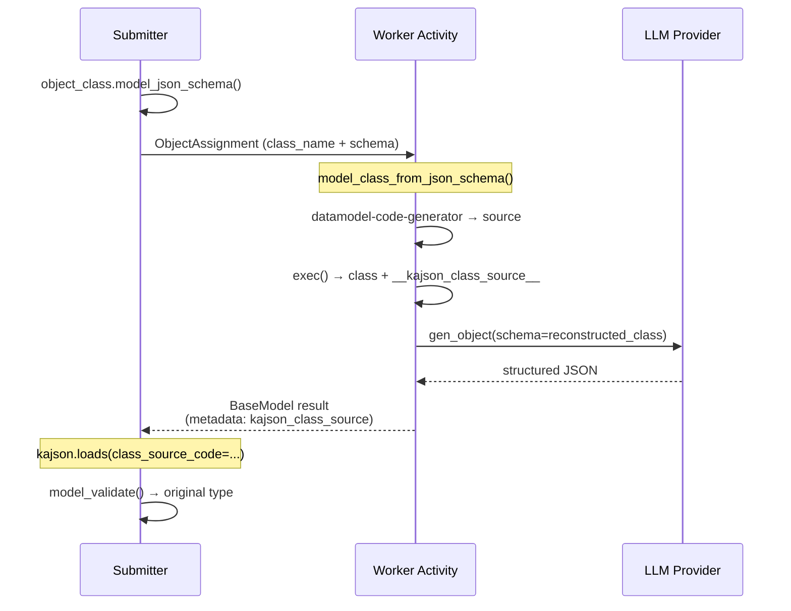

# Distributed Content Generation

This page is for contributors working on Pipelex internals. If you're deploying or operating Pipelex on Temporal, see the user-facing [Distributed Execution with Temporal](../distributed-execution/temporal/index.md) guide instead.

This page covers the serialization mechanisms that enable content generation (LLM structured output, image generation, PDF extraction, web search) to run across Temporal worker processes. For the broader Temporal architecture — LibraryCrate propagation, deferred hydration, per-workflow scoping — see [Temporal Integration](./temporal-integration.md).

!!! note "Every inference leaf goes through the same seam"
    All inference operators dispatch their leaf call through the swappable `ContentGenerator` abstraction: direct inline (`ContentGenerator`) or as a Temporal activity (`ContentGeneratorInWorkflow`); the backend choice is independent of the run mode — under `run_mode=DRY` the chosen backend still dispatches and the cogt leaf mocks inside it. Web search (`PipeSearch`) joined this seam last — its `act_search_gen_*` activities make search-on-Temporal replay-safe (the result is recorded in workflow history) and let search failures cross the workflow boundary as classified errors. An operator that runs its leaf inline instead would re-execute it on every replay and, on failure, hang the submitter with an unclassified workflow-task error.

---

## The Two Serialization Challenges

Content generation introduces two cross-cutting problems that don't exist in single-process mode:

| Challenge | Trigger | Root cause | Solution |
|-----------|---------|------------|----------|
| **Dynamic class propagation** | LLM structured output (`PipeLLM` with object concept) | Submitter creates a Pydantic model at runtime from `.mthds` concept definitions; the worker process has no such class | Embed JSON schema in assignment, reconstruct class on worker, carry source code through Temporal payload metadata |
| **Large payload management** | Image generation (`PipeImgGen`), PDF extraction (`PipeExtract`) | Binary data (base64 images, rendered pages) exceeds Temporal's ~2MB payload limit | Activities store binary data to external storage, return lightweight URI references |

---

## Dynamic Class Propagation

### Schema embedding

When a pipe produces structured output, the caller captures the Pydantic model's JSON schema into the assignment — a serializable Temporal argument that carries everything the worker needs:

```python
class ObjectAssignment(BaseModel):
    object_class_name: str
    object_class_schema: dict[str, Any]
    llm_assignment_for_object: LLMAssignment

    @staticmethod
    def make_for_class(
        object_class: type[BaseModel],
        llm_assignment: LLMAssignment,
    ) -> "ObjectAssignment":
        return ObjectAssignment(
            object_class_name=object_class.__name__,
            object_class_schema=object_class.model_json_schema(),
            llm_assignment_for_object=llm_assignment,
        )
```

The schema is a plain `dict` — fully serializable, visible in the Temporal dashboard, and self-contained. No class reference crosses the process boundary.

### Schema-to-model reconstruction

On the worker, `model_class_from_json_schema()` rebuilds a live Pydantic class from the embedded schema:

```python
source_code = _generate_source_from_schema(schema)        # datamodel-code-generator
reconstructed_class = _exec_and_extract_class(source_code, class_name)  # exec()
reconstructed_class.__kajson_class_source__ = source_code  # attached for downstream use
```

The reconstruction pipeline:

1. **Generate** — `datamodel-code-generator` converts the JSON schema into Python source code defining a `BaseModel` subclass.
2. **Execute** — `exec()` compiles the source in an isolated namespace and extracts the named class.
3. **Cache** — A thread-safe SHA-256 hash cache (with double-check locking) avoids redundant generation for the same schema.
4. **Tag** — The generated source code is attached as `__kajson_class_source__` on the class, enabling Kajson to carry it through Temporal payloads.

!!! warning "Class name normalization"
    `datamodel-code-generator` normalizes schema titles to PascalCase (e.g., `dynamic_concept_test__Greeting` becomes `DynamicConceptTestGreeting`). The code tries both the original and normalized names. If neither matches, it raises `ValueError` listing the available classes.

### Source code injection into Temporal payloads

When the activity returns a `BaseModel` whose class has `__kajson_class_source__`, the custom `BaseModelPayloadConverter` injects it into the Temporal payload metadata:

**Serialization** (`to_payload`):

```python
class_source = getattr(type(value), "__kajson_class_source__", None)
if class_source is not None:
    metadata["kajson_class_source"] = class_source.encode()
```

**Deserialization** (`from_payload`):

```python
source_bytes = payload.metadata.get("kajson_class_source")
class_source_code = source_bytes.decode() if source_bytes else None
pydantic_gizmo = kajson.loads(
    data,
    class_registry=get_class_registry(),
    class_source_code=class_source_code,
)
# Re-attach source so it survives further Temporal hops
if class_source_code is not None:
    if isinstance(pydantic_gizmo, BaseModel):
        type(pydantic_gizmo).__kajson_class_source__ = class_source_code
    elif isinstance(pydantic_gizmo, list):
        for item in pydantic_gizmo:
            if isinstance(item, BaseModel):
                type(item).__kajson_class_source__ = class_source_code
```

The source code rides in Temporal metadata (not the payload data itself), keeping the JSON payload clean and the class reconstruction transparent. After `kajson.loads()` reconstructs the object, the converter re-attaches `__kajson_class_source__` to the deserialized class — this ensures the source survives if the object crosses another Temporal boundary (e.g. workflow returning a result to a parent activity that forwards it elsewhere).

### The type bridge

The class reconstructed on the worker is a structural match to the original, but it is a different Python class in memory. Standard `isinstance()` checks would fail. The caller bridges this gap with a `model_validate` round-trip:

```python
raw_obj = await llm_gen_object(object_assignment=object_assignment)
return object_class.model_validate(raw_obj.model_dump(serialize_as_any=True))
```

`model_dump(serialize_as_any=True)` produces a plain dict from the reconstructed object, and `model_validate()` rebuilds it as a proper instance of the original class. This restores type safety for downstream code.

### End-to-end flow



### Structured web search reuses the same mechanism

Structured web search (`PipeSearch` with a non-text output concept) faces the identical dynamic-class problem and solves it the same way. `SearchObjectAssignment` mirrors `ObjectAssignment` — it ships `output_class_name` + `output_class_schema` alongside the `SearchAssignment`, the activity reconstructs a throwaway class via `SchemaToModelFactory` to drive the provider call, and the activity returns the **raw result dict**. The submitter re-validates that dict against the original output class (`output_structure_class.model_validate(result_dict)`) — a pure, deterministic step that keeps the dynamic class on the submitter side and never ships it across the boundary. The sourced-answer path (`make_search_sourced_answer`) has no dynamic class at all: it returns a `SearchResultContent`, a native serializable model.

---

## Large Payload Management

### The payload size constraint

Temporal payloads have a practical limit around 2MB. A single generated image can exceed this in base64 encoding. PDF extraction produces multiple page images. Sending raw binary through Temporal would either fail with a `DataConverterError` or severely degrade workflow history performance.

### The store-then-reference pattern

Activities handle the full binary lifecycle internally — generate, store, return a lightweight reference:

```python
@activity.defn
async def act_img_gen_images(img_gen_assignment: ImgGenAssignment) -> list[ImageContent]:
    """Generate images and store them, returning lightweight ImageContent references.

    Large binary data (base64/bytes) is stored within the activity and never crosses
    the Temporal workflow boundary — only URLs are returned.
    """
    storage_provider = get_storage_provider()
    generated_content_factory = GeneratedContentFactory(storage_provider=storage_provider)
    return await img_gen_image_list_and_store(
        img_gen_assignment=img_gen_assignment,
        generated_content_factory=generated_content_factory,
    )
```

`GeneratedContentFactory` uploads binary data via the configured `StorageProviderAbstract` (S3, local filesystem, etc.) and returns `ImageContent` or `PageContent` — Pydantic models carrying URIs, MIME types, and metadata, but never raw bytes.

!!! info "What crosses the boundary"
    `ImageContent` carries `url` (storage URI), `public_url`, `mime_type`, `size`, `caption` — but never raw bytes. The `url` can be an S3 URI, HTTP URL, or local file path depending on storage configuration.

### Content type scenarios

| Content type | Activity | What gets stored | What crosses the Temporal boundary |
|-------------|----------|-----------------|-----------------------------------|
| Generated image | `act_img_gen_images` | Base64/bytes → S3 via `GeneratedContentFactory` | `list[ImageContent]` with URIs |
| Extracted pages | `act_extract_gen_extract_pages` | Extracted page images → S3 | `list[PageContent]` with URI references |
| Rendered page views | `act_render_page_views` | PDF page renders → S3 | `list[ImageContent]` with URIs |
| LLM text | `act_llm_gen_text` | Nothing stored (text is small) | Plain `str` |
| LLM object | `act_llm_gen_object` | Nothing stored (JSON is small) | `BaseModel` + `__kajson_class_source__` in metadata |
| Search sourced answer | `act_search_gen_sourced_answer` | Nothing stored (answer + source refs are small) | `SearchResultContent` (answer + `DocumentContent` sources) |
| Search structured | `act_search_gen_structured` | Nothing stored (JSON is small) | Raw `dict`, re-validated against the output class on the submitter |

---

## Kajson Class Resolution

When `kajson.loads()` receives both a `class_registry` and `class_source_code`, the resolution follows a priority chain:

```python
if class_source_code is not None:
    source_registry = _build_registry_from_source(class_source_code)
    if class_registry is not None:
        # Source-derived classes fill gaps; explicit registry takes priority
        for name, cls in source_registry.root.items():
            if not class_registry.has_class(name):
                class_registry.register_class(cls, name=name, ...)
    else:
        class_registry = source_registry
```

Resolution order:

1. **Explicit `class_registry`** — the per-workflow scoped registry (see [Temporal Integration](./temporal-integration.md#per-workflow-scoping))
2. **Source-derived classes** — from `class_source_code`, filling gaps in the explicit registry
3. **`sys.modules`** — already-imported classes
4. **Dynamic import** — last resort, importing the module path from `__module__` metadata

!!! note "exec() safety"
    `_build_registry_from_source()` uses `exec()` internally. The source code originates from `datamodel-code-generator` running against the same JSON schema the submitter used — it is never user-supplied arbitrary code.

---

## File Reference

| Component | File |
|-----------|------|
| Assignment models (schema embedding) | `pipelex/cogt/content_generation/assignment_models.py` |
| Schema-to-model reconstruction | `pipelex/cogt/content_generation/schema_to_model_factory.py` |
| Content generator (type bridge) | `pipelex/cogt/content_generation/content_generator.py` |
| LLM generation functions | `pipelex/cogt/content_generation/llm_generate.py` |
| Search generation functions | `pipelex/cogt/content_generation/search_generate.py` |
| Generated content factory (storage) | `pipelex/cogt/content_generation/generated_content_factory.py` |
| Temporal data converter | `pipelex/temporal/temporal_data_converter.py` |
| Image generation activity | `pipelex/temporal/tprl_content_generation/act_img_gen_generate.py` |
| Extract activity | `pipelex/temporal/tprl_content_generation/act_extract_generate.py` |
| Search activity | `pipelex/temporal/tprl_content_generation/act_search_generate.py` |
| Page view rendering activity | `pipelex/temporal/tprl_content_generation/act_render_page_views.py` |
| Kajson serialization | `kajson` (external PyPI package) |
| ImageContent model | `pipelex/core/stuffs/image_content.py` |
| PageContent model | `pipelex/core/stuffs/page_content.py` |

---

## Next Steps

- [Temporal Integration](./temporal-integration.md) — LibraryCrate propagation, deferred hydration, per-workflow scoping
- [Pipe Routing & Execution](./pipe-routing-and-execution.md) — how PipeJobs travel through the system
- [Architecture Overview](./architecture-overview.md) — the two-layer design and how components fit together
