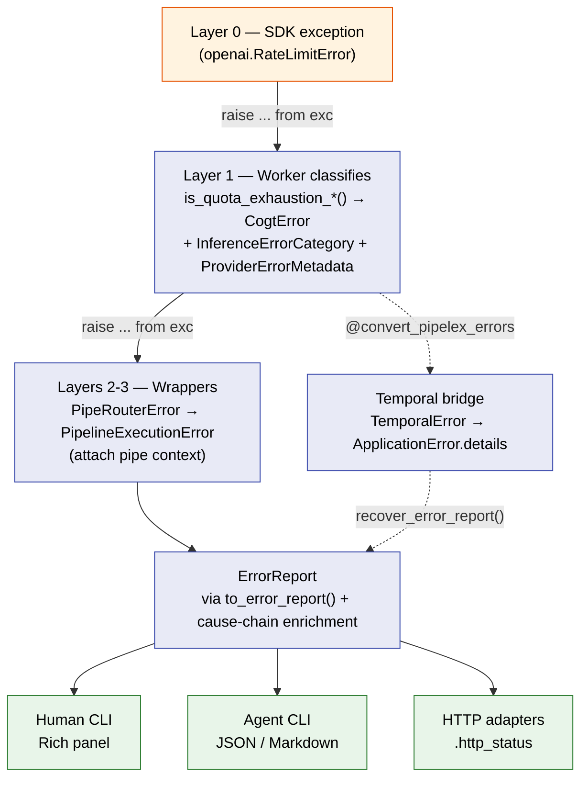

# Error Model

In Pipelex, an error is **data**, not a control-flow accident. Every failure is classified once — at the layer that knows the most about it — and that classification travels intact to every consumer: the human reading a Rich panel, the agent parsing JSON, the Temporal retry engine, and the HTTP adapter picking a status code.

This page covers the contract that makes that possible: the `ErrorReport` schema, the classification enums, how inference workers classify SDK exceptions, how classification survives every wrapping layer, and how it crosses the Temporal boundary.

---

## Design Principle

Three rules hold across the codebase, and everything else builds on them.

**Single-rooted hierarchy.** Every custom exception inherits from `PipelexError` (`pipelex/base_exceptions.py`). There is one root, so one `to_error_report()` contract covers the whole tree.

**Classify at the source, never lose it.** The layer that catches a third-party exception knows the most about it. It classifies there. Every layer above is a *wrapper* — it adds context (pipe code, stack) but inherits the classification rather than re-deriving or discarding it.

**No broad catches in business logic.** `except Exception` is allowed only at CLI entry points and async task roots. Ruff rule `BLE001` enforces this — an unexpected exception crashes loudly instead of being silently swallowed.

!!! info "Why classify, instead of just propagating the exception?"
    A raw `openai.RateLimitError` tells a Python `except` clause what to catch, but it does not tell the Temporal retry engine whether to retry, the HTTP adapter which status to emit, or an agent whether the failure is the user's fault. Classification turns an exception into a decision input that every consumer can act on uniformly.

---

## The Layer Model

An error rises through a series of layers. Each layer has exactly one job.

| Layer | Role | What it does with errors |
|-------|------|--------------------------|
| **5 — CLI entry points** | `pipelex` / `pipelex-agent` commands | Catch, format for human (Rich) / agent (JSON·MD) / HTTP |
| **4 — CLI factories** | `cli_factory.py`, `agent_cli_factory.py` | Catch setup errors, route to handlers |
| **3 — Pipeline runner** | `PipelexMTHDSProtocol.execute()` | Catch + wrap as `PipelineExecutionError` |
| **2 — Pipe router / operators** | `PipeRouter`, pipe operators | Catch + wrap with pipe context (`pipe_code`, `pipe_stack`) |
| **1 — Workers / SDK calls** | `pipelex/plugins/*/` | **Catch the SDK exception → classify → raise `CogtError`** |
| **0 — Third-party SDKs** | OpenAI, Anthropic, Google, … | Raise raw, untyped provider exceptions |

Classification happens once, at **Layer 1**. Layers 2–5 are wrappers: they attach context as they catch and re-raise, but the `error_category`, `error_domain`, `model`, and `provider` set at Layer 1 reach Layer 5 unchanged (see [Cause-Chain Enrichment](#cause-chain-enrichment)).

---

## ErrorReport — the Serialization Schema

`ErrorReport` (`pipelex/base_exceptions.py`) is the single source of truth for error serialization. It is a frozen Pydantic model with `extra="forbid"`.

| Field | Type | Meaning |
|-------|------|---------|
| `error_type` | `str` | The exception class name |
| `message` | `str` | Human-readable message |
| `title` | `str` | Stable human-readable summary — the RFC 7807 `title` |
| `type_uri` | `str` | Per-class documentation URI — the RFC 7807 `type` |
| `error_category` | `str \| None` | `InferenceErrorCategory` value (inference errors only) |
| `error_domain` | `str \| None` | `ErrorDomain` value — `input` / `config` / `runtime` |
| `retryable` | `bool \| None` | Whether a retry could succeed |
| `user_action` | `UserAction \| None` | Typed advice — `kind` + free-form `detail` |
| `model` | `str \| None` | Model handle, when the failure is attributable to one |
| `provider` | `str \| None` | Backend name, when attributable |
| `provider_metadata` | `ProviderErrorMetadata \| None` | SDK metadata — status code, request id, `retry_after` |

`PipelexError.to_error_report()` is the entry point. `to_dict()` serializes, dropping `None` fields; `from_dict()` is its strict inverse.

```python
report = exc.to_error_report()
report.to_dict()         # {"error_type": "LLMCompletionError", "message": "...", ...}
ErrorReport.from_dict(d) # strict inverse — raises ValidationError on a malformed dict
report.http_status       # 422 / 429 / 500 — for HTTP adapters
```

!!! warning "`ErrorReport` is `extra="forbid"`"
    `from_dict()` rejects unknown keys. `recover_error_report()` calls it directly: a report dict that is found but fails validation is an internal contract bug — the activity bridge and the submitter share the schema within one deploy. `recover_error_report()` catches the `ValidationError` and synthesizes an `UnrecoverableWorkflowFailureError` fallback (carrying the recovered message plus an `[error report failed schema validation]` marker) so failure-webhook delivery stays intact; the workflow still fails afterwards, keeping the contract bug visible. Any other caller of `from_dict()` should treat the validation failure as a bug to fix.

---

## Classification Enums

Two `StrEnum`s drive every downstream decision.

### InferenceErrorCategory

Defined in `pipelex/cogt/exceptions.py`. Drives retry decisions — `is_retryable` is `True` only for `TRANSIENT`.

| Category | Meaning | Retryable | Typical cause |
|----------|---------|-----------|---------------|
| `TRANSIENT` | A brief, self-correcting failure | ✅ | Rate limit, 5xx, connection blip |
| `CONFIGURATION` | The setup is wrong | ❌ | Bad API key, missing backend |
| `CONTENT` | The input or prompt is wrong | ❌ | Content-policy violation, bad prompt |
| `CAPACITY` | Account quota / billing exhausted | ❌ | `insufficient_quota`, HTTP 402 |
| `AMBIGUOUS` | Outcome unknown — may have committed | ❌ | Connection dropped mid-request |
| `UNKNOWN` | Could not classify | ❌ | Unrecognized inner exception |

```python
class InferenceErrorCategory(StrEnum):
    TRANSIENT = "transient"
    # ... CONFIGURATION, CONTENT, CAPACITY, AMBIGUOUS ...
    UNKNOWN = "unknown"

    @property
    def is_retryable(self) -> bool:
        match self:
            case InferenceErrorCategory.TRANSIENT:
                return True
            case _:  # all other categories
                return False
```

!!! info "`AMBIGUOUS` vs `UNKNOWN`"
    `AMBIGUOUS` means the *error type is known* but the operation may or may not have committed — a blind retry is unsafe for a non-idempotent call. `UNKNOWN` means classification itself failed. Both are non-retryable, for different reasons.

### ErrorDomain

Defined in `pipelex/base_exceptions.py`. Set as a class-level attribute on the exception, drives HTTP status.

| Domain | Meaning | HTTP status | Who can fix it |
|--------|---------|-------------|----------------|
| `INPUT` | Caller sent something it can fix | **422** | The caller |
| `CONFIG` | Environment / configuration change needed | **500** | The operator |
| `RUNTIME` | A failure during execution | **500** | Depends on the cause |

`error_domain_to_http_status()` is the pure mapping table. `ErrorReport.http_status` layers one rule on top: a provider 429 (`provider_metadata.status_code == 429`) takes precedence over the domain, so the API can emit a `Retry-After` header.

```python
class PipelexConfigError(PipelexError):
    error_domain = ErrorDomain.CONFIG     # class-level — every instance carries it
```

---

## Worker Classification

Layer 0 → Layer 1. Every inference worker under `pipelex/plugins/*/` catches its SDK's typed exceptions and re-raises a categorized `CogtError`.

### The Uniform Shape — Extract / Classify / Render

Every inference worker's SDK-exception handler collapses to a three-step pipeline: **Extract** turns the SDK exception into a provider-blind `ProviderErrorMetadata`, **Classify** maps that metadata to a category + user-action, and **Render** picks the `CogtError` subclass to raise.

```python
except (APIError, APIConnectionError, APITimeoutError) as exc:
    metadata = extract_openai_metadata(exc)
    classification = classify_inference_error(metadata)
    raise render_llm_error(
        family=InferenceErrorFamily.LLM_COMPLETION,
        metadata=metadata,
        classification=classification,
        model_desc=self.inference_model.desc,
    ) from exc
```

The three steps live in three modules. Only the per-provider Extract functions stay plugin-local; Classify and Render are single shared functions.

| Module | Step | What it owns |
|--------|------|--------------|
| `pipelex/cogt/inference/error_classification.py` | Extract | `ProviderErrorMetadata`, `SDKErrorEnvelope`, `UserAction`, `UserActionKind`, the 12 `extract_*_metadata` functions, plus pure discriminators (`is_quota_exhaustion`, `is_content_policy_violation`, `is_network_error`) exposed as `@property` on the metadata |
| `pipelex/cogt/inference/error_classify.py` | Classify | `classify_inference_error()` — provider-blind mapping from `ProviderErrorMetadata` → `ClassificationResult(category, user_action_kind, is_model_not_found)` |
| `pipelex/cogt/inference/error_render.py` | Render | `render_llm_error()` / `render_img_gen_error()` / `render_extract_error()` / `render_search_error()` — picks the `CogtError` subclass from `InferenceErrorFamily` plus `is_model_not_found` (e.g. `LLMModelNotFoundError` vs `LLMCompletionError`) |

Provider-specific nuance is normalized away in Extract (e.g. Google's `code` becomes `status_code`; AWS Bedrock error codes are mapped to HTTP statuses), so Classify has no provider branching. HTTP status drives classification; status-less errors dispatch on the SDK exception type name. The `tests/unit/pipelex/cogt/inference/test_provider_classification_parity.py` meta-test walks every `ProviderName` against the extract-fn registry so adding a new provider without wiring it fails fast.

### ProviderErrorMetadata and UserAction

Every raised inference error carries structured SDK metadata and typed advice.

```python
class ProviderErrorMetadata(BaseModel):
    provider: str
    sdk_exception_type: str
    status_code: int | None = None
    request_id: str | None = None
    retry_after_seconds: float | None = None
    provider_error_code: str | None = None
    body: Any | None = Field(default=None, exclude=True)   # may carry secrets
```

!!! warning "`body` is excluded from serialization"
    The raw provider response `body` can carry account ids, billing details, or credential fragments. It is held in-process but `exclude`d from every serialized form — CLI JSON, agent output, Temporal details.

`UserAction` pairs a discrete `UserActionKind` (`WAIT_AND_RETRY`, `CHECK_BILLING`, `CHECK_CREDENTIALS`, `CHANGE_INPUT`, `CHANGE_MODEL`, `CONTACT_SUPPORT`, `UNKNOWN`) with a free-form `detail` string — so the CLI can render consistent guidance while keeping provider-specific text.

### The `instructor` Unwrap

On structured-generation paths, `instructor` wraps the real SDK exception in an `InstructorRetryException`. `extract_underlying_sdk_exception()` recovers it, so it routes through the same per-provider categorization as the plain-text path. A genuinely unrecognized inner exception (e.g. a `pydantic.ValidationError` from a schema mismatch) lands in `UNKNOWN` rather than being mis-labelled as a `CONTENT`-policy violation.

### Model and Provider Attribution

Inference-failure leaf errors (`LLMCompletionError`, `ImgGenGenerationError`, …) are raised deep inside a plugin and do not know which model handle invoked them. Each worker family fills that in at its public-method chokepoint:

```python
def fill_model_and_provider(self, model_handle: str | None, backend_name: str | None) -> None:
    """Fill model_handle / backend_name from the worker, only when still unset."""
```

---

## Cause-Chain Enrichment

A wrapper exception — `PipeRunError` → `PipeRouterError` → `PipelineExecutionError` — carries no `error_category` of its own. `to_error_report()` enriches the report from the `__cause__` chain, so the inference classification survives every wrapping layer.

```python
def _enrich_error_report_from_cause(self, report: ErrorReport) -> ErrorReport:
    cause = self.__cause__
    if not isinstance(cause, PipelexError):
        return report
    cause_report = cause.to_error_report()
    return ErrorReport(
        error_type=report.error_type,                                  # keep own identity
        message=report.message,
        error_category=report.error_category or cause_report.error_category,
        error_domain=report.error_domain or cause_report.error_domain,
        # ... retryable, user_action, model, provider, provider_metadata ...
    )
```

A wrapper keeps its own `error_type` and `message` but inherits every classification field it does not set itself.

!!! warning "Overrides must call the enrichment helper"
    A `to_error_report()` override on a subclass **must** end with `self._enrich_error_report_from_cause(report)`. Otherwise that subclass becomes a black hole that drops the cause's classification. A cyclic-`__cause__` guard ensures a malformed chain can never turn error reporting into a `RecursionError`.

---

## The Temporal Error Bridge

When a pipe runs on a Temporal worker, the error must survive serialization across the **activity → workflow → submitter** boundary. Temporal's default failure converter would wrap a raw `PipelexError` without packing the `ErrorReport` or deriving the retry decision. The bridge closes that gap.

### Activity Side — `convert_pipelex_errors`

A decorator applied beneath `@activity.defn` on every in-scope activity converts a `PipelexError` into a `TemporalError`.

```python
@activity.defn
@convert_pipelex_errors
async def act_llm_gen_text(llm_assignment: LLMAssignment) -> str:
    return await llm_gen_text(llm_assignment=llm_assignment)
```

`TemporalError.from_message_exception()` does two things:

- **Derives `non_retryable`** from `InferenceErrorCategory.is_retryable` for category-carrying errors. (The configured `non_retryable_error_types` class-name list is the fallback for category-less exceptions.)
- **Packs the report** — `to_error_report().to_dict()` goes into `ApplicationError.details`, so workflow code keeps the full classification, not just a message string.

### Submitter Side — `recover_error_report`

Once the failure returns to the process that submitted the workflow, `recover_error_report()` walks the `__cause__` chain for the `ApplicationError`, pulls the details-packed dict, and rebuilds the `ErrorReport`. It is **total** — callers in the error-recovery path always get a structured report.

```python
def recover_error_report(exc: BaseException) -> ErrorReport:
    report_dict = _find_error_report_dict(exc)
    if report_dict is not None:
        return ErrorReport.from_dict(report_dict)
    return UnrecoverableWorkflowFailureError(_message_from_exc(exc)).to_error_report()
```

When no report dict is found in the chain — a non-Pipelex exception, a worker crash, a heartbeat timeout — the function synthesizes an `UnrecoverableWorkflowFailureError` report so the recovery path always has structured classification to surface. A report dict that fails `ErrorReport.from_dict` validation is treated as an internal contract bug (writer and reader share the schema within one deploy) and is also synthesized into the same `UnrecoverableWorkflowFailureError` fallback — carrying the recovered message plus an `[error report failed schema validation]` marker — so the failure webhook still fires; the workflow still fails afterwards, keeping the contract bug visible.

The recovered report is carried on `WorkflowExecutionError(error_report=...)`, whose `to_error_report()` override returns it. Since `WorkflowExecutionError` is a `PipelexError`, `PipelineExecutionError` inherits the classification natively.

### Workflow-Level Fail-Safe Floor

The activity bridge converts every error that crosses an *activity* boundary. But a `PipelexError` raised **inline in workflow code** — an operator that runs its leaf inline instead of dispatching it as an activity, or an inline setup error — is neither an `ActivityError` nor an `ApplicationError`. Temporal's default for an unhandled exception in workflow code that is *not* a recognized failure type is to treat it as a **workflow-task failure** and retry the task indefinitely (bounded only by the workflow execution timeout). That is the single worst outcome a durable-execution system can produce: invisible, resource-consuming, and surfaced only after ~the timeout as a generic timeout error rather than the real cause. The fail-safe floor closes that hole on two levels:

- **Workflow-level catch-all (rich path).** `WfPipeRouter.run()` and `WfPipeRun.run()` each end their boundary handling with an `except PipelexError` clause. `WfPipeRouter` converts a genuine inline error to a terminal `TemporalError` via `from_message_exception` (same conversion the activity bridge does — the structured report rides in `ApplicationError.details`). `WfPipeRun` routes it through its deferred-delivery path so the FAILED webhook still fires, then chains a details-carrying `TemporalError` so the classification also survives to the submitter. The catch-all only converts *genuine* inline errors: an escaping `PipelexError` that already carries a Temporal failure in its `__cause__` chain (e.g. a nested child-dispatch that already wrapped a sub-pipe failure as `WorkflowExecutionError`) is already terminal and recoverable, so it propagates untouched rather than being flattened to a generic report.

- **Worker-level floor (belt-and-suspenders).** The worker registers `workflow_failure_exception_types=[WorkflowExecutionError, PipelexError]`. Any domain error that slips past the catch-alls still fails the workflow **terminally** instead of hanging — degrading to a synthesized `UnrecoverableWorkflowFailureError` report (message preserved, classification floored) rather than a silent retry loop. The scope is deliberately `PipelexError`, not `Exception`: genuinely transient Temporal/infra errors and deterministic-replay glitches are not domain errors, and workflow-task retry is the *correct* behavior for them — so they keep Temporal's default.

The rule of thumb: in a durable-execution system the default for "unexpected exception in business logic inside a workflow" is the most dangerous behavior available (retry forever), so "we convert all the errors we know about" is not enough — the floor must hold for the errors, and the code paths, that nobody enumerated.

**Net effect:** a pipe failing on a Temporal worker reaches the CLI and HTTP adapters with the *same* `error_category` / `retryable` / `model` / `provider` / `user_action` as the identical failure run locally — and a failure that escapes inline fails loud and bounded instead of hanging.

---

## Interfaces

### CLI

The agent CLI (`pipelex-agent`) emits a structured error to **stderr**, markdown by default and JSON with `--error-format json`. When `--error-format` is omitted it **inherits the value of `--format`** (the success-output flag) — so `--format json` still flips both as it did before the split. Both exit with code 1.

| Command | Error output |
|---------|--------------|
| `run`, `validate`, `init`, `models`, `check-model`, `doctor` | Markdown (default) or JSON via `--error-format` (or via `--format`, which `--error-format` inherits) |
| `inputs`, `concept`, `pipe`, `accept-gateway-terms` | JSON only |
| `fmt`, `lint` | Native `plxt` output (subprocess passthrough); falls back to JSON only when the `plxt` binary itself is missing |

The human CLI (`pipelex`) renders a Rich error panel — red banner, structured fields, the `user_action` tip, doc/Discord links — through the shared `display_error_panel()` helper in `pipelex/cli/error_handlers.py`.

### API

`pipelex` is a library — there is no API server in the package. Downstream HTTP repos consume the `ErrorReport`:

- `error_domain_to_http_status(error_domain)` — pure domain → status table.
- `ErrorReport.http_status` — full property, layering the provider-429 passthrough on top.

A downstream FastAPI exception handler calls `ErrorReport.http_status` and is a trivial adapter — it must not redefine the mapping.

### Inputs and Outputs

**Inputs.** `to_error_report()` takes a live `PipelexError`. `recover_error_report()` takes any `BaseException` and walks its `__cause__` chain. `ErrorReport.from_dict()` takes a `to_dict()` payload — strictly, raising `ValidationError` on drift.

**Outputs.** `to_error_report()` returns an `ErrorReport`; `to_dict()` returns a `None`-free `dict`. Side effects: telemetry events emitted on pipeline failure at Layer 3; the agent CLI writes to stderr and raises `typer.Exit(1)`.

---

## Architecture



---

## Implementation

### Class Hierarchy

`PipelexError` is the single root. `CogtError` is the inference branch — it overrides `to_error_report()` to add `error_category`, `retryable`, `user_action`, `provider_metadata`, and reads `model_handle` / `backend_name` from the instance.

```
Exception
└── PipelexError                  base_exceptions.py — error_domain, user_action, to_error_report()
    ├── PipelexConfigError         → error_domain = CONFIG
    ├── PipelexSetupError          → error_domain = CONFIG
    ├── CogtError                  cogt/exceptions.py — error_category, provider_metadata
    │   ├── LLMCompletionError      ← per-instance category from the worker
    │   ├── ImgGenGenerationError   ← per-instance category
    │   ├── ModelNotFoundError      ← sibling family raised on provider HTTP 404
    │   │   ├── LLMModelNotFoundError / ImgGenModelNotFoundError
    │   │   └── ExtractModelNotFoundError / SearchModelNotFoundError
    │   └── ... (see worker classification) ...
    ├── PipelineExecutionError      pipeline/exceptions.py — error_domain = RUNTIME
    └── ... (one exceptions.py per package) ...
```

### Factory-time vs Runtime

| When | What carries metadata | How |
|------|----------------------|-----|
| **Class definition** | `error_domain`, `error_category` defaults, `user_action` defaults | Class-level attributes — one source of truth per exception type |
| **Raise time** | Per-instance `error_category`, `user_action`, `provider_metadata` | Constructor args — set by the worker that classified the failure |
| **Report time** | `model`, `provider`, cause-chain fields | `fill_model_and_provider()` at the worker chokepoint; `_enrich_error_report_from_cause()` on `to_error_report()` |

The "outcome" exceptions (`LLMCompletionError`, `ImgGenGenerationError`, `ExtractJobFailureError`, `SearchJobFailureError`) intentionally carry **no** class-level `error_category` — their category is genuinely per-instance, decided by the worker.

---

## Reference

### Quick-Ref

```python
# Produce a report from any PipelexError
report = exc.to_error_report()          # enriched from the __cause__ chain
payload = report.to_dict()              # None-free dict for serialization

# Consume a report
report.http_status                      # 422 / 429 / 500
report.user_action_detail()             # free-form advice text, or None
report.error_category                   # "transient" / "capacity" / ...

# Round-trip across a boundary
ErrorReport.from_dict(payload)           # strict inverse of to_dict()
recover_error_report(temporal_failure)   # walk __cause__ for an ApplicationError

# Retry decision
InferenceErrorCategory.TRANSIENT.is_retryable   # True — only TRANSIENT
```

### File → Purpose

| File | Purpose |
|------|---------|
| `pipelex/base_exceptions.py` | `PipelexError`, `ErrorReport`, `ErrorDomain`, `error_domain_to_http_status()` |
| `pipelex/cogt/exceptions.py` | `CogtError`, `InferenceErrorCategory` |
| `pipelex/cogt/inference/error_classification.py` | Extract — `ProviderErrorMetadata`, `SDKErrorEnvelope`, `UserAction`, `UserActionKind`, per-provider `extract_*_metadata` functions, pure discriminators |
| `pipelex/cogt/inference/error_classify.py` | Classify — `classify_inference_error()`, `ClassificationResult` |
| `pipelex/cogt/inference/error_render.py` | Render — `render_llm_error()` / `render_img_gen_error()` / `render_extract_error()` / `render_search_error()`, `InferenceErrorFamily` |
| `pipelex/cogt/inference/provider_name.py` | `ProviderName` enum keying the extract-fn registry |
| `pipelex/plugins/*/` | Per-provider inference workers — Layer 0 → 1 classification |
| `pipelex/pipeline/exceptions.py` | `PipelineExecutionError`, `PipeExecutionError` |
| `pipelex/temporal/tprl/temporal_error.py` | `TemporalError`, `from_message_exception`, `recover_error_report` |
| `pipelex/temporal/tprl/activity_error_boundary.py` | `convert_pipelex_errors` decorator |
| `pipelex/temporal/tprl/workflow_caller.py` | `WorkflowExecutor`, `WorkflowExecutionError` recovery |
| `pipelex/cli/error_handlers.py` | Human CLI Rich panels — `display_error_panel()` |
| `pipelex/cli/agent_cli/commands/agent_output.py` | Agent CLI JSON / markdown delivery |

### Behavior Summary

| Scenario | Behavior |
|----------|----------|
| Rate limit hit | `TRANSIENT` → retryable; transport retry honors `Retry-After` |
| Quota / billing exhausted | `CAPACITY` → non-retryable; `UserAction(CHECK_BILLING)` |
| Bad API key | `CONFIGURATION` → non-retryable; `error_domain = CONFIG` → HTTP 500 |
| Model or deployment not found (provider HTTP 404) | Raises a dedicated `*ModelNotFoundError` sibling (`LLMModelNotFoundError`, `ImgGenModelNotFoundError`, `ExtractModelNotFoundError`, `SearchModelNotFoundError`); operator re-raises `PipeOperatorModelAvailabilityError` |
| Content-policy violation | `CONTENT` → non-retryable; `UserAction(CHANGE_INPUT)` |
| LLM returns schema-mismatched JSON | `instructor` re-asks; if exhausted → `UNKNOWN` |
| Connection dropped mid-request | `AMBIGUOUS` → non-retryable (outcome unknown) |
| Wrapper exception (no own category) | Inherits cause's classification via enrichment |
| Failure on a Temporal worker | `ErrorReport` recovered from `ApplicationError.details` — same classification as local |
| Worker exception with no `ErrorReport` | Synthesized `UnrecoverableWorkflowFailureError` report — `error_domain = RUNTIME` |

---

## Next Steps

- [Pipe Routing & Execution](./pipe-routing-and-execution.md) — the layer model errors rise through
- [Temporal Integration](./temporal-integration.md) — the activity → workflow boundary the error bridge spans
- [Cogt Configuration](../configuration/config-technical/cogt-config.md) — `transport_max_retries` and the Tier 1 retry policy
- [Agent CLI](../tools/cli/agent-cli.md) — the JSON / markdown error contract
