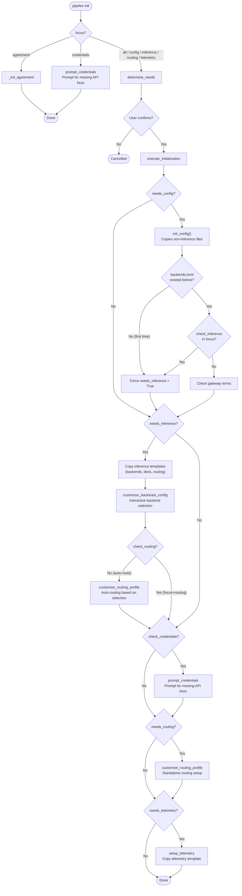
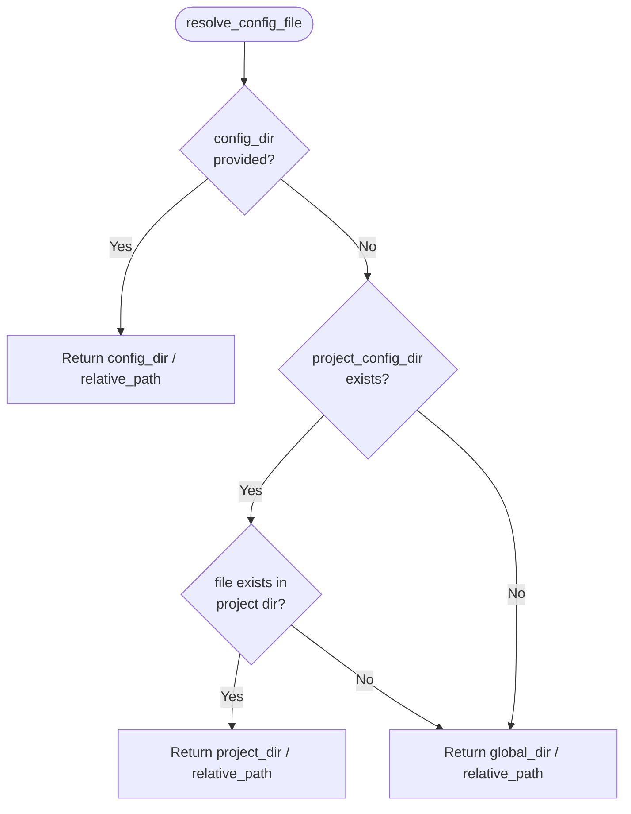
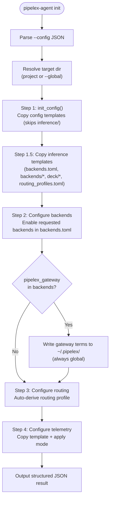

# Init CLI Flows

`pipelex init` sets up the `.pipelex/` configuration directory. It handles four independent concerns — config files, inference backends, routing profiles, and telemetry — through a focus-based dispatch system. Each concern owns its own file-copying and customization logic, so they can be run together or individually without interference.

---

## Why This Design

The `.pipelex/` directory contains two categories of files with different lifecycles:

1. **Config files** (`pipelex.toml`, `plxt.toml`, `mthds_schema.json`) — static templates, copied once, rarely touched by the user.
2. **Inference files** (`inference/backends.toml`, `inference/routing_profiles.toml`, `inference/backends/*.toml`, `inference/deck/*.toml`) — interactive setup, customized per-project based on which AI backends the user selects.

These two categories are managed by separate steps. `init_config()` copies only config files (skipping the `inference/` directory entirely). The inference step handles its own template copying and then runs interactive backend selection and routing customization. Each file is owned by exactly one step — `init_config()` explicitly skips the `inference/` directory via `INIT_SKIP_DIRS`, and skips `telemetry.toml` and `pipelex_service.toml` via `INIT_SKIP_FILES`. This separation ensures that re-running `pipelex init config` never overwrites a user's carefully tuned inference setup.

---

## Interfaces

### CLI Commands

| Command | Focus | What It Does |
|---------|-------|--------------|
| `pipelex init` | `all` | Full setup: config + inference + routing + telemetry |
| `pipelex init config` | `config` | Copy config templates, then trigger inference if first-time |
| `pipelex init inference` | `inference` | Interactive backend selection + routing |
| `pipelex init routing` | `routing` | Routing profile customization only |
| `pipelex init telemetry` | `telemetry` | Telemetry config template copy |
| `pipelex init agreement` | `agreement` | Gateway terms acceptance (no reset) |
| `pipelex init credentials` | `credentials` | Credential setup for enabled backends |

All commands except `agreement` and `credentials` perform a **full reset** (overwrite existing files). Config updates are not yet supported.

### Inputs

- **`focus`** (`InitFocus` enum): Determines which steps run. Derived from the CLI subcommand.
- **`skip_confirmation`** (`bool`): When `True`, skips the interactive confirmation prompt. Used when called from `pipelex doctor --fix`.
- **`local`** (`bool`): When `True`, targets the project-level `.pipelex/` directory instead of the global `~/.pipelex/`. Maps to the `--local` CLI flag.

### Outputs / Side Effects

| Artifact | Produced By | Target Dir | Path |
|----------|-------------|------------|------|
| `pipelex.toml` | `init_config()` | Project or global | `.pipelex/pipelex.toml` |
| `plxt.toml` | `init_config()` | Project or global | `.pipelex/plxt.toml` |
| `mthds_schema.json` | `init_config()` | Project or global | `.pipelex/mthds_schema.json` |
| `backends.toml` | Inference step | Project or global | `.pipelex/inference/backends.toml` |
| `backends/*.toml` | Inference step | Project or global | `.pipelex/inference/backends/` |
| `deck/*.toml` | Inference step | Project or global | `.pipelex/inference/deck/` |
| `routing_profiles.toml` | Inference step | Project or global | `.pipelex/inference/routing_profiles.toml` |
| `telemetry.toml` | Telemetry step | Project or global | `.pipelex/telemetry.toml` |
| `.env` | Credentials step | **Always global** | `~/.pipelex/.env` (mode 0600) |
| `pipelex_service.toml` | Gateway terms acceptance | **Always global** | `~/.pipelex/pipelex_service.toml` |

!!! info "Project vs global"
    Most files are written to the target directory chosen at init time (project `.pipelex/` or global `~/.pipelex/`). The exceptions are `.env` (credentials) and `pipelex_service.toml`, which are **always** written to and read from `~/.pipelex/` — see [Gateway Terms: Always Global](#gateway-terms-always-global).

---

## Architecture

### Overall Flow



---

## Implementation

### Determine Needs

`determine_needs()` evaluates the current state of `.pipelex/` to decide which steps are required:

```python
nb_missing_config_files = init_config(reset=False, dry_run=True) if check_config else 0
needs_config = check_config and (nb_missing_config_files > 0 or reset)
needs_inference = check_inference and (not path_exists(backends_toml_path) or reset)
needs_routing = check_routing and (not path_exists(routing_profiles_toml_path) or reset)
needs_telemetry = check_telemetry and (not path_exists(telemetry_config_path) or reset)
```

The `check_*` flags are derived from the `focus` parameter:

| Focus | `check_config` | `check_credentials` | `check_inference` | `check_routing` | `check_telemetry` |
|-------|:-:|:-:|:-:|:-:|:-:|
| `all` | Yes | Yes | Yes | No | Yes |
| `config` | Yes | Yes | No | No | No |
| `inference` | No | Yes | Yes | No | No |
| `routing` | No | No | No | Yes | No |
| `telemetry` | No | No | No | No | Yes |

!!! info "Routing is separate from inference"
    `check_routing` is only `True` for `focus=routing`. When `focus=all`, routing is handled automatically as part of the inference step (Step 2), not as a standalone step.

### Step 1: Config Step — `init_config()`

Copies the config template tree from `kit/configs/` to `.pipelex/`, with two skip mechanisms:

```python
INIT_SKIP_FILES: frozenset[str] = GIT_IGNORED_CONFIG_FILES | {TELEMETRY_CONFIG_FILE_NAME, ".DS_Store"}
INIT_SKIP_DIRS: frozenset[str] = frozenset({"inference"})
```

The recursive `copy_directory_structure` function checks both sets before processing each entry:

```python
if item in INIT_SKIP_FILES:
    continue
if os.path.isdir(src_item):
    if item in INIT_SKIP_DIRS:
        continue
    # recurse...
```

### First-Time Inference Detection

After `init_config()` runs, `execute_initialization` decides whether inference setup is needed — even if inference was not in the original focus:

```python
backends_existed_before = path_exists(backends_toml_path)
init_config(reset=reset)
backends_exists_now = path_exists(backends_toml_path)

if not backends_existed_before or (check_inference and backends_exists_now):
    needs_inference = True
```

This handles two scenarios:

| Condition | Meaning | Action |
|-----------|---------|--------|
| `not backends_existed_before` | First-time setup (no inference yet) | Force inference step regardless of focus |
| `check_inference and backends_exists_now` | Inference in focus + existing config | Re-run inference (reset) |

When inference is **not** forced and backends already exist, gateway terms are still checked:

```python
if not needs_inference and backends_existed_before:
    _check_gateway_terms_if_needed(console, backends_toml_path)
```

### Step 2: Inference Step

When `needs_inference` is `True` and `reset` is `True`, the inference step copies its own template files independently:

1. `backends.toml` — main backend registry
2. `backends/*.toml` — per-backend configuration files
3. `deck/*.toml` — model deck configurations
4. `routing_profiles.toml` — routing profile definitions

Then runs interactive customization:

1. `customize_backends_config()` — prompts user to select backends, handles gateway terms, and suggests IDE extension installation via `suggest_extension_install_if_needed()`
2. `customize_routing_profile()` — auto-configures routing based on selected backends (**only when `check_routing` is `False`**, i.e. when routing is not the specific focus)

When `focus=routing`, the inference step skips routing entirely because Step 3 handles it as a standalone operation.

### Step 2.5: Credentials Step

When `check_credentials` is `True` (for `focus` in `all`, `config`, `inference`), `prompt_credentials()` checks which backends are enabled and prompts the user for any missing API keys. Credentials are stored in `~/.pipelex/.env` with mode 0600.

### Step 3: Routing Step

If `needs_routing` is `True` (only for `focus=routing`), runs `customize_routing_profile()` as a standalone step.

### Step 4: Telemetry Step

Copies a telemetry template and prints instructions. No interactive prompts. Which template is copied depends on the target:

- **Global init** (target is `~/.pipelex/`): copies `pipelex/kit/configs/telemetry.toml` — the active template with disabled-by-default settings.
- **Project init** (target is `{project_root}/.pipelex/`): copies `pipelex/kit/configs/telemetry.project.toml` — every setting commented out so the project file does not shadow `~/.pipelex/telemetry.toml` or `~/.pipelex/telemetry_override.toml` during layered loading.

`setup_telemetry()` selects the template via a `for_project: bool` arg passed down from the `--local` flag on `pipelex init`.

---

## Scenario Matrix

| Scenario | Focus | Config Step | Inference Step | Credentials | Routing Step | Gateway Terms | Telemetry Step |
|----------|-------|:-----------:|:--------------:|:-----------:|:------------:|:-------------:|:--------------:|
| Fresh project, full init | `all` | Copies config files | Copies templates + interactive selection | Prompted | Auto (part of inference) | Via `customize_backends_config` | Copies template |
| Fresh project, config only | `config` | Copies config files | Forced (first-time detected) | Prompted | Auto (part of inference) | Via `customize_backends_config` | Skipped |
| Existing project, full re-init | `all` | Overwrites config files | Resets templates + interactive selection | Prompted | Auto (part of inference) | Via `customize_backends_config` | Overwrites template |
| Existing project, config only | `config` | Overwrites config files | Skipped (backends already exist) | Prompted | Skipped | `_check_gateway_terms_if_needed` | Skipped |
| Existing project, inference only | `inference` | Skipped | Resets templates + interactive selection | Prompted | Auto (part of inference) | Via `customize_backends_config` | Skipped |
| Existing project, routing only | `routing` | Skipped | Skipped | Skipped | Resets template + interactive selection | Skipped | Skipped |
| Existing project, credentials only | `credentials` | Skipped | Skipped | Prompted | Skipped | Skipped | Skipped |
| Gateway terms only | `agreement` | Skipped | Skipped | Skipped | Skipped | Direct acceptance | Skipped |

!!! warning "Config-Only on Existing Project"
    Running `pipelex init config` on a project that already has `inference/backends.toml` will overwrite config files (`pipelex.toml`, etc.) but will **not** touch the inference setup. Gateway terms are still checked via `_check_gateway_terms_if_needed`. The user's backend selection and routing are preserved.

---

## File Reference

### Template Directory (`kit/configs/`)

| File / Directory | Copied By | Purpose |
|-----------------|-----------|---------|
| `pipelex.toml` | `init_config()` | Main Pipelex configuration |
| `plxt.toml` | `init_config()` | PLXT tooling configuration |
| `mthds_schema.json` | `init_config()` | MTHDS JSON Schema for IDE support |
| `inference/` | Inference step | All inference configuration (see below) |
| `inference/backends.toml` | Inference step | Backend registry (enabled/disabled flags) |
| `inference/backends/*.toml` | Inference step | Per-backend settings (API keys, endpoints) |
| `inference/deck/*.toml` | Inference step | Model deck definitions |
| `inference/routing_profiles.toml` | Inference step | Routing profile definitions |
| `telemetry.toml` | Telemetry step | Telemetry export configuration |
| `pipelex_service.toml` | Agreement step | Gateway service terms tracking |

### Skip Lists

| Constant | Contents | Reason |
|----------|----------|--------|
| `INIT_SKIP_FILES` | All `GIT_IGNORED_CONFIG_FILES` (`pipelex_service.toml`, `pipelex_override.toml`, `telemetry_override.toml`, `telemetry.project.toml`, `pipelex_gateway_models.md`, `pipelex_gateway_models_plain.md`, `x_custom_llm_deck.toml`, `x_custom_extract_deck.toml`) plus `telemetry.toml` and `.DS_Store` | Git-ignored, auto-generated, or managed by other steps |
| `INIT_SKIP_DIRS` | `inference` | Managed independently by inference step |

### Source Modules

| Module | Purpose |
|--------|---------|
| `pipelex/cli/commands/init/command.py` | Orchestration: `init_cmd()`, `execute_initialization()`, `determine_needs()` |
| `pipelex/cli/commands/init/config_files.py` | Config file copying: `init_config()`, skip lists |
| `pipelex/cli/commands/init/backends.py` | Backend customization: `customize_backends_config()`, `get_selected_backend_keys()` |
| `pipelex/cli/commands/init/routing.py` | Routing customization: `customize_routing_profile()` |
| `pipelex/cli/commands/init/telemetry.py` | Telemetry setup: `setup_telemetry()` |
| `pipelex/cli/commands/init/credentials.py` | Credential prompting: `prompt_credentials()`, `write_env_file()`, `read_env_file()` |
| `pipelex/cli/commands/init/ide_extension.py` | IDE extension suggestion: `suggest_extension_install_if_needed()` |
| `pipelex/cli/commands/init/ui/types.py` | `InitFocus` enum definition |

---

## Config Directory Resolution

The `ConfigLoader` (singleton: `config_manager`) resolves where configuration files live. Understanding this logic is essential because bugs in directory resolution cause files to be written or read from the wrong location.

**Source:** `pipelex/system/configuration/config_loader.py`

### Three Directory Properties

| Property | Path | When it exists |
|----------|------|----------------|
| `global_config_dir` | `~/.pipelex/` | Always (created on first use) |
| `project_config_dir` | `{project_root}/.pipelex/` | Only if the directory exists on disk |
| `pipelex_config_dir` | Project if exists, else global | Always (backward-compat alias) |

### Project Root Detection

`find_project_root()` walks up from `cwd` looking for marker files:

- `.git`, `pyproject.toml`, `setup.py`, `setup.cfg`, `package.json`, `.hg`

The home directory (`~`) is explicitly excluded — even if it contains a `package.json`, it is never treated as a project root.

### File Resolution Order

`resolve_config_file(relative_path, config_dir)` uses layered resolution:



This means a project-level file **wins** over the global one, but only if it actually exists on disk.

### Global Config Bootstrap

`ensure_global_config_exists()` creates `~/.pipelex/` with kit template files on first use (called automatically during `load_config()`). It skips all `GIT_IGNORED_CONFIG_FILES` (files like `pipelex_service.toml`) and `.DS_Store` — these are never part of the bootstrap copy.

### Config Loading Chain

`load_config()` merges configuration in this order (later values override earlier ones):

1. Package defaults (`pipelex/pipelex.toml`)
2. Global config (`~/.pipelex/pipelex.toml`)
3. Project config (`{project_root}/.pipelex/pipelex.toml`, if different from global)
4. Override files from the effective config dir (local, environment, run mode, override)

---

## Gateway Terms: Always Global

`pipelex_service.toml` is **always** written to and read from `~/.pipelex/`, never from a project directory. This is an intentional invariant.

**Why:** Gateway terms are a user-level agreement, not a per-project setting. Accepting terms once should apply everywhere.

### Write Locations

All writers explicitly target `config_manager.global_config_dir`:

| Context | Module | `mkdir` before write? |
|---------|--------|-----------------------|
| Interactive init (config step) | `init/command.py` → `_check_gateway_terms_if_needed()` | Yes |
| Interactive backends | `init/backends.py` → `customize_backends_config()` | Yes |
| Agreement step | `init/command.py` → `_init_agreement()` | Yes (in `update_service_terms_acceptance`) |
| Agent CLI | `agent_cli/commands/init_cmd.py` → `_configure_backends()` | Yes |

### Read Locations

| Context | Module | How |
|---------|--------|-----|
| Doctor | `doctor_cmd.py` → `check_models()` | `load_pipelex_service_config_if_exists(config_dir=global_config_dir)` |
| Runtime | `pipelex.py` setup | `load_pipelex_service_config_if_exists(config_dir=global_config_dir)` |

### Rules

- **`mkdir` before writing**: All write paths ensure the config directory exists before writing. Some callers call `global_config_dir.mkdir(parents=True, exist_ok=True)` explicitly, and `update_service_terms_acceptance()` itself ensures the directory exists, so every path is protected.
- **Git-ignored**: `pipelex_service.toml` is in `GIT_IGNORED_CONFIG_FILES`, so it is never copied by `init_config()` and never synced to a project directory.

**Source:** `pipelex/system/pipelex_service/pipelex_service_agreement.py`, `pipelex/system/pipelex_service/pipelex_service_config.py`

---

## Agent CLI Init

`pipelex-agent init` is the non-interactive counterpart to `pipelex init`. It runs the same steps but takes all inputs from a JSON config argument instead of interactive prompts.

**Source:** `pipelex/cli/agent_cli/commands/init_cmd.py`

### Target Directory Resolution

`_resolve_target_dir(global_)` determines where files are written:

| Flag | Target |
|------|--------|
| Default (no flag) | `{project_root}/.pipelex/` — project root detected via `find_project_root()` |
| `--global` / `-g` | `~/.pipelex/` |

If no project root is found and `--global` is not set, the command fails with an error.

### Config Input

`--config` / `-c` accepts a JSON string (inline or file path) with these optional fields:

| Field | Type | Purpose |
|-------|------|---------|
| `backends` | `list[str]` | Backend keys to enable (e.g. `"openai"`, `"anthropic"`, `"pipelex_gateway"`) |
| `primary_backend` | `str` | Required when 2+ backends selected and `pipelex_gateway` is not among them |
| `accept_gateway_terms` | `bool` | Sets gateway terms acceptance (defaults to `false` if omitted) |
| `telemetry_mode` | `str` | `"off"` (default), `"anonymous"`, or `"identified"` |

### Flow



!!! note "No credentials step"
    The agent CLI does **not** configure credentials. Use `pipelex-agent doctor` to check credential health, or `pipelex init credentials` for interactive credential setup.

### Key Differences from Interactive Init

| Aspect | `pipelex init` | `pipelex-agent init` |
|--------|---------------|---------------------|
| Prompts | Interactive (Rich prompts) | None — all input from `--config` JSON |
| Gateway terms | Prompted interactively | From `accept_gateway_terms` field in config |
| Output | Rich console output | Structured JSON via `agent_success()` / `agent_error()` |
| Credentials | Prompted interactively | Not configured — use `pipelex-agent doctor` or `pipelex init credentials` |
| Focus dispatch | Supports individual focus (`config`, `inference`, etc.) | Runs config, inference, routing, telemetry (no credentials) |
| Target dir default | Global (`~/.pipelex/`), use `--local` for project | Project (`{project_root}/.pipelex/`), use `--global` for global |

---

## Doctor Fix: Config Dir Handling

`pipelex doctor` and `pipelex doctor --fix` use the config directory resolution to find and fix configuration issues wherever they live.

**Source:** `pipelex/cli/commands/doctor_cmd.py`

### How Each Check Resolves Files

| Check | Resolution Method | Details |
|-------|-------------------|---------|
| `check_config_files()` | `resolve_config_file()` | Layered resolution (project > global) |
| `check_telemetry_config()` | `resolve_config_file()` | Layered resolution (project > global) |
| `check_backend_credentials()` | `resolve_config_file()` | Finds `backends.toml` wherever it lives |
| `check_backend_files()` | `resolve_config_file()` | Finds `inference/backends/` wherever it lives |
| `check_models()` gateway terms | `global_config_dir` | **Always global** — reads from `~/.pipelex/` |

### Fix Targeting

When `--fix` replaces an outdated backend file, it derives the config directory from the resolved file path:

```python
# File lives at {config_dir}/inference/backends/{name}.toml
# Walk up 3 levels to get the config_dir
resolved_config_dir = Path(backend_file_report.file_path).parent.parent.parent
replace_backend_file(backend_name, config_dir=resolved_config_dir)
```

This ensures the fix targets the same directory where the issue was found — if the broken file was in the project `.pipelex/`, the replacement goes there too, not to `~/.pipelex/`.

---

## Next Steps

- [:material-cog: Configuration Internals](../contribute/configuration-defaults-and-overrides.md){ .md-button }
- [:material-sitemap: Architecture Overview](./architecture-overview.md){ .md-button }
