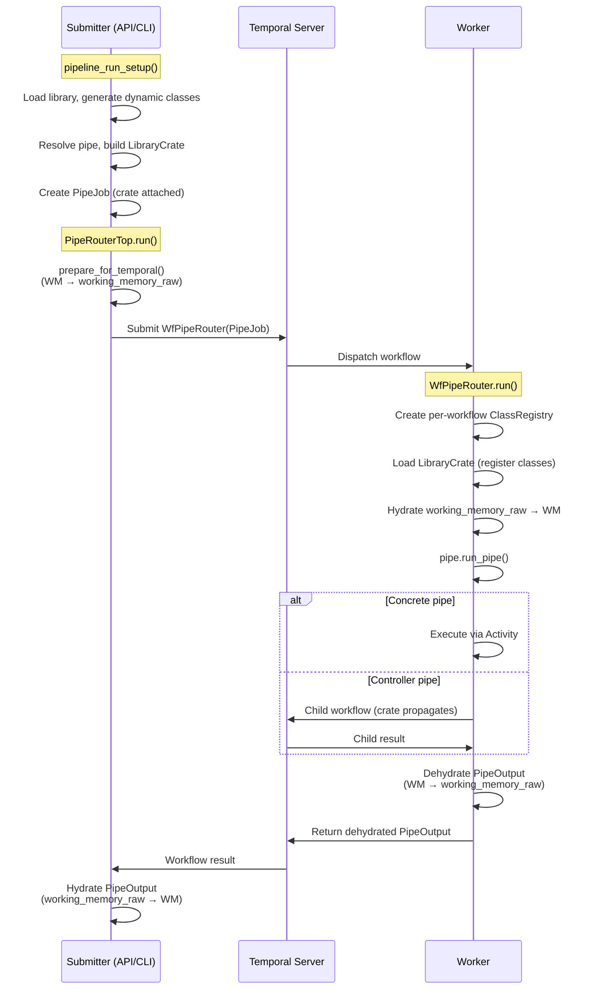
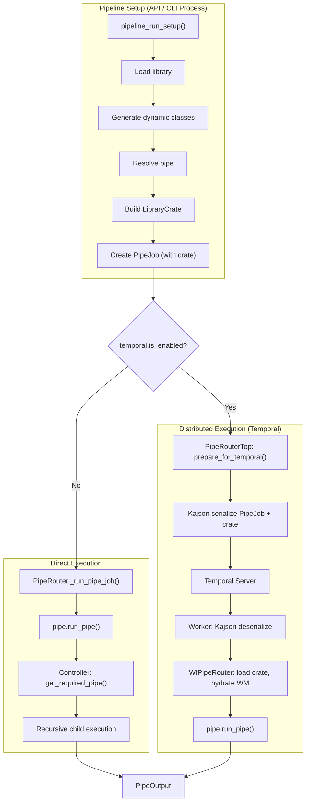

# Pipe Routing & Execution

Pipelex runs pipes either **direct** (single-process) or **distributed** on a host runtime. Both share the same pipe definitions, library loading, and controller logic. The key difference is *where* the pipe runs and how the PipeJob travels to get there. The distributed host runtime today is your own Temporal workers ([Pipelex on Temporal](../distributed-execution/temporal/index.md)); a managed Mistral Workflows backend (also built on Temporal) is coming soon. Both reach pipe execution through the same framework-agnostic runtime bridge.

---

## Terminology

| Term | Meaning |
|------|---------|
| **Direct execution** | All pipes run in the same Python process. Library, class registry, and pipe resolution are shared in-memory. |
| **Distributed execution** | PipeJob is serialized and sent to a remote worker — a Pipelex Temporal worker, or a Mistral Workflows activity. The worker is a separate process (potentially on a different machine). |

---

!!! note "The runtime bridge"
    Both distributed paths go through the framework-agnostic runtime bridge (`pipelex/runtime_bridge/`). Its `primitives/` layer is shared by `pipelex.temporal` and the in-development Mistral Workflows host package: it classifies controller pipes as child workflows and leaf operators as activities (`pipe_classification.py`), hydrates working memory, flushes trace events, and delivers results in a host-neutral way. Graph and token-usage assembly is not a bridge primitive — it lives in `pipelex/pipe_run/tracing_assembly.py` and runs the same way for local and distributed runs.

---

## Design Principle

Every pipe execution — regardless of mode — follows the same pattern:

1. **Setup**: `pipeline_run_setup()` loads the library, resolves the pipe, initializes working memory, and creates a `PipeJob`
2. **Route**: A router (`PipeRouter` or `PipeRouterTop`) receives the PipeJob and dispatches it
3. **Execute**: The pipe's `run_pipe()` method runs, potentially resolving and executing child pipes

The `PipeJob` is the universal unit of execution. It carries everything needed to run a single pipe.

---

## The PipeJob Model

`PipeJob` encapsulates all information needed to execute a pipe.

| Field | Type | Purpose |
|-------|------|---------|
| `pipe` | `PipeAbstract` | The resolved pipe object (concrete operator or controller) |
| `working_memory` | `WorkingMemory \| None` | Runtime data store — typed `Stuff` objects keyed by variable name |
| `working_memory_raw` | `dict \| None` | Raw JSON dict of WorkingMemory for deferred hydration (Temporal only) |
| `pipe_run_params` | `PipeRunParams` | Execution config: run mode (LIVE/DRY), output multiplicity, pipe stack for cycle detection |
| `job_metadata` | `JobMetadata` | Pipeline run ID, user ID, OTel tracing context, graph tracing context |
| `output_name` | `str \| None` | Override for the output variable name |
| `library_crate` | `LibraryCrate \| None` | Serializable library snapshot for distributed execution |

`PipeJob` is created by `pipeline_run_setup()`, which handles library loading, pipe resolution, working memory initialization, and telemetry setup. For Temporal dispatch, `prepare_for_temporal()` moves `working_memory` to `working_memory_raw` (deferred hydration) and ensures the crate is attached.

---

## Library Loading

Before a pipe can execute, the **library** must be loaded. The library contains:

- **Pipes** — all pipe definitions (operators and controllers), resolved by code via `get_required_pipe()`
- **Concepts** — semantic type definitions that determine what data a `Stuff` object holds
- **Domains** — namespaces that group related pipes and concepts

### Base vs Custom Libraries

- **Base libraries** are loaded from directories listed in `PIPELEXPATH`. They contain shared pipe/concept definitions available to all executions.
- **Custom bundles** are per-request `mthds_content` strings. Each API call can bring its own definitions.

### Dynamic Class Generation

When a `.mthds` file declares a concept like `RawText = "Raw input text..."`, the library loading process:

1. `ConceptFactory._handle_basic_blueprint()` detects the concept declaration
2. `StructureGenerator.generate_from_structure_blueprint()` dynamically creates a Python class (e.g., `RawText` inheriting from `TextContent`)
3. The class is registered with the active `ClassRegistry` (accessed via `hub.get_class_registry()`) so it can be serialized/deserialized

These dynamically-generated classes become the `content` type of `Stuff` objects in `WorkingMemory`.

!!! info "Why Dynamic Classes Matter"
    When a PipeJob is serialized (e.g., for Temporal transport), Kajson embeds `__class__` and `__module__` metadata. The receiving process must have these classes registered in its class registry to deserialize the payload.

---

## Direct Execution

In direct execution, everything runs in a single Python process. This is the default mode when Temporal is not enabled.

### Flow

```
pipeline_run_setup()
  ├── Load library (library_manager singleton)
  ├── Generate dynamic concept classes
  ├── Register classes with Kajson
  ├── Resolve pipe via get_required_pipe(pipe_code)
  ├── Initialize WorkingMemory from inputs
  └── Return PipeJob

PipeRouter.run(pipe_job)
  ├── Notify observers (before)
  ├── _run_pipe_job(pipe_job)
  │   └── pipe_job.pipe.run_pipe(...)     ← delegates directly to the pipe
  │       ├── Concrete pipe: execute operator logic (LLM call, template, etc.)
  │       └── Controller: resolve child pipes via get_required_pipe(),
  │           then recursively call child.run_pipe()
  ├── Notify observers (after)
  └── Return PipeOutput
```

### Router Selection

The router is selected during `Pipelex.setup()`:

```python
if get_config().temporal.is_enabled:
    effective_pipe_router = make_tprl_pipe_router_top()   # Distributed
else:
    effective_pipe_router = PipeRouter(observer=...)       # Direct
```

### How PipeRouter Works

`PipeRouter` implements `PipeRouterProtocol` with a minimal `_run_pipe_job()`:

```python
async def _run_pipe_job(self, pipe_job, wfid=None):
    return await pipe_job.pipe.run_pipe(
        job_metadata=pipe_job.job_metadata,
        working_memory=pipe_job.working_memory,
        output_name=pipe_job.output_name,
        pipe_run_params=pipe_job.pipe_run_params,
    )
```

The router does not route by pipe type — it delegates to the pipe itself. Controllers handle their own orchestration internally.

---

## Pipe Controllers

Controllers are pipes that orchestrate the execution of other pipes. They resolve child pipes at runtime via `get_required_pipe()` from the library.

| Controller | Behavior |
|------------|----------|
| **PipeSequence** | Executes `sequential_sub_pipes` one after another. Each step receives working memory with outputs from previous steps. |
| **PipeBatch** | Iterates over a `ListContent` input. For each item, loads `branch_pipe` and executes it with a deep copy of working memory. Items run concurrently via asyncio. |
| **PipeCondition** | Evaluates a Jinja2 `expression` against working memory, maps the result via `outcome_map` to a pipe code, and executes that pipe. |
| **PipeParallel** | Loads multiple child pipes and executes them concurrently, each with its own working memory copy. |

All controllers follow the same pattern:

1. Call `get_required_pipe(child_pipe_code)` to resolve the child pipe from the library
2. Route through `get_pipe_router().run(PipeJob(...))` — the hub auto-selects the right router
3. Aggregate results into working memory or output

### Auto-Switching Router

The hub (`get_pipe_router()`) automatically returns the correct router based on context:

- **Direct execution**: Returns `PipeRouter` — child pipes run in-process
- **Distributed execution, outside workflow** (submitter side): Returns `PipeRouterTop` — submits a top-level Temporal workflow
- **Distributed execution, inside workflow** (worker side): Returns `PipeRouterChild` — creates a Temporal child workflow via `execute_child_workflow()`

This means each child pipe in a controller gets its own Temporal workflow boundary in distributed mode — enabling independent retries, separate worker assignment, and per-pipe visibility in the Temporal UI.

!!! note "Library Dependency"
    Controllers depend on the library being loaded in the current process. `get_required_pipe()` queries the library scoped to the current workflow via `ContextVar`, which must have been populated by loading a `LibraryCrate`. In distributed execution, each `WfPipeRouter` loads the crate from the `PipeJob` into a per-workflow `Library` instance. Controllers call `get_required_pipe()` inside Temporal workflow code — accessing per-workflow state via ContextVar. The Temporal sandbox is disabled (`--is-not-sandboxed`) because library loading is a side effect incompatible with replay semantics.

---

## Distributed Execution

In distributed execution, the PipeJob is serialized and sent to a Temporal worker for execution.

### Flow



### Key Components

**PipeRouterTop** (`pipelex/temporal/tprl_pipe/pipe_router_top.py`)

Implements `PipeRouterProtocol` like `PipeRouter`, but dispatches via Temporal instead of direct execution. Uses `WorkflowExecutor` to submit `WfPipeRouter` workflows.

**WfPipeRouter** (`pipelex/temporal/tprl_pipe/wf_pipe_router.py`)

The Temporal workflow that runs on the worker. Receives a deserialized `PipeJob` and calls `pipe.run_pipe()` — exactly like the direct router.

**Kajson Data Converter** (`pipelex/temporal/temporal_data_converter.py`)

Custom Temporal payload converter that uses Kajson for serializing/deserializing Pydantic models. Preserves subclass types during transport, which is critical because `PipeJob.pipe` is a `PipeAbstract` subclass and `WorkingMemory` contains `Stuff` objects with concept-specific content classes.

**Worker CLI** (`pipelex/temporal/worker_cli.py`)

Entry point for the worker process. Calls `Pipelex.make(temporal_enabled=True)` to initialize the framework, then starts the Temporal worker with registered workflows and activities.

### Content Generation Activities

Concrete pipe operators (PipeLLM, PipeCompose, PipeExtract, PipeImgGen) dispatch dedicated Temporal activities for their actual work. Activities are invoked directly from inside `WfPipeRouter` via `ContentGeneratorInWorkflow` (`pipelex/temporal/tprl_content_generation/content_generator_in_workflow.py`), which calls `workflow.execute_activity(act_*, ...)` — there is no intermediate child workflow per content-generation call.

| Activity | Purpose |
|----------|---------|
| `act_llm_gen_text` | LLM text generation |
| `act_llm_gen_object` | LLM structured output (single object) |
| `act_llm_gen_object_list` | LLM structured output (list) |
| `act_jinja2_gen_text` | Jinja2 template rendering |
| `act_extract_gen_extract_pages` | Document extraction (OCR) |
| `act_render_page_views` | PDF page rendering (page-views) |
| `act_img_gen_images` | Image generation |

All content-generation activities resolve dispatch via `worker_config.resolve_dispatch(...)`, so task-queue routing can be configured per activity (and, where applicable, per handle) through `[temporal.worker_config.activity_queues]`. If no routing is configured, activities fall back to the workflow's own task queue.

### Worker Environment

The `@with_conditional_worker` decorator on `PipeRouterTop._run_pipe_job()` supports two environments:

- **EXTERNAL** (production) — assumes a worker is already running, submits the workflow directly
- **INTERNAL** (testing) — spins up an embedded worker for the duration of the execution

!!! note "Future Improvement: Per-Pipe Routing"
    Router selection is currently global and binary: either all pipes go through Temporal, or none do. A simple `PipeCompose` (microseconds of Jinja2 rendering) gets the same Temporal overhead as a `PipeLLM` (minutes of API call time). Per-pipe or per-type routing decisions could improve efficiency.

---

## LibraryCrate, Deferred Hydration, and Per-Workflow Isolation

Distributed execution introduces three mechanisms that don't exist in direct mode. These solve the fundamental challenge: the worker is a separate process that doesn't share the submitter's library, class registry, or working memory state.

For a detailed walkthrough of these mechanisms, see [Temporal Integration](./temporal-integration.md).

### LibraryCrate Propagation

The submitter builds a `LibraryCrate` — a serializable snapshot of all pipes and concepts — and attaches it to the `PipeJob`. Each `WfPipeRouter` on the worker loads the crate into a per-workflow scoped library, making all pipes resolvable via `get_required_pipe()`.

### Deferred Hydration (Input and Output)

Deferred hydration applies to both **PipeJob inputs** and **PipeOutput return values**. In both cases, `WorkingMemory` is serialized as a raw JSON dict (`working_memory_raw`) instead of a typed object, avoiding deserialization failures when dynamic concept classes aren't registered in the receiving process's class registry.

- **Input**: `PipeJob.prepare_for_temporal()` moves `working_memory` to `working_memory_raw` before dispatch. The worker hydrates it after loading the crate.
- **Output**: `PipeOutput.prepare_for_temporal()` does the same before returning from a child workflow. The parent (`PipeRouterChild` or `PipeRouterTop`) hydrates after receiving.

### Per-Workflow ClassRegistry and Library Scoping

Each workflow creates its own `ClassRegistry` (pre-seeded from the global registry) and its own `Library` instance, both scoped via `ContextVar`. This ensures concurrent workflows with conflicting concept names (e.g., two bundles that both define `Result` with different fields) don't cross-contaminate.

### Known Limitation: StuffArtefact Serialization in Dry-Run

PipeCondition and PipeCompose dispatch the `act_jinja2_gen_text` activity (via `ContentGeneratorInWorkflow.make_templated_text`) to render their expression / construct templates. The activity serializes working memory contents through the Temporal data converter. In dry-run mode, working memory contains `StuffArtefact` debug objects that are not JSON-serializable, causing these internal activities to fail. PipeBatch also fails in dry-run (likely a related serialization issue in child PipeJob creation). PipeSequence and PipeParallel are unaffected — they dispatch child pipes through `SubPipe.run_pipe()` without internal templating activities. See [Temporal Integration](./temporal-integration.md#known-limitation-stuffartefact-serialization-in-dry-run) for details and fix direction.

---

## Architecture Diagram



---

## File Reference

| Component | File |
|-----------|------|
| PipeJob model | `pipelex/pipe_run/pipe_job.py` |
| Pipeline setup | `pipelex/pipeline/pipeline_run_setup.py` |
| PipeRouter (direct) | `pipelex/pipe_run/pipe_router.py` |
| PipeRouterProtocol | `pipelex/pipe_run/pipe_router_protocol.py` |
| PipeRouterTop (distributed, outside workflow) | `pipelex/temporal/tprl_pipe/pipe_router_top.py` |
| PipeRouterChild (distributed, inside workflow) | `pipelex/temporal/tprl_pipe/pipe_router_child.py` |
| Auto-switch utility | `pipelex/temporal/temporal_workflow_utils.py` |
| WfPipeRouter workflow | `pipelex/temporal/tprl_pipe/wf_pipe_router.py` |
| Kajson data converter | `pipelex/temporal/temporal_data_converter.py` |
| Worker CLI | `pipelex/temporal/worker_cli.py` |
| Library manager | `pipelex/libraries/library_manager.py` |
| ConceptFactory | `pipelex/core/concepts/concept_factory.py` |
| StructureGenerator | `pipelex/core/concepts/structure_generation/generator.py` |
| LibraryCrate model | `pipelex/libraries/library_crate.py` |
| LibraryCrate factory | `pipelex/libraries/library_crate_factory.py` |
| Deferred hydration utility | `pipelex/temporal/tprl_pipe/hydration.py` |
| Hub (get_required_pipe, get_class_registry) | `pipelex/hub.py` |
| PipeSequence | `pipelex/pipe_controllers/sequence/pipe_sequence.py` |
| PipeCondition | `pipelex/pipe_controllers/condition/pipe_condition.py` |
| PipeBatch | `pipelex/pipe_controllers/batch/pipe_batch.py` |
| PipeParallel | `pipelex/pipe_controllers/parallel/pipe_parallel.py` |
| Router selection | `pipelex/pipelex.py` (in `Pipelex.setup()`) |
