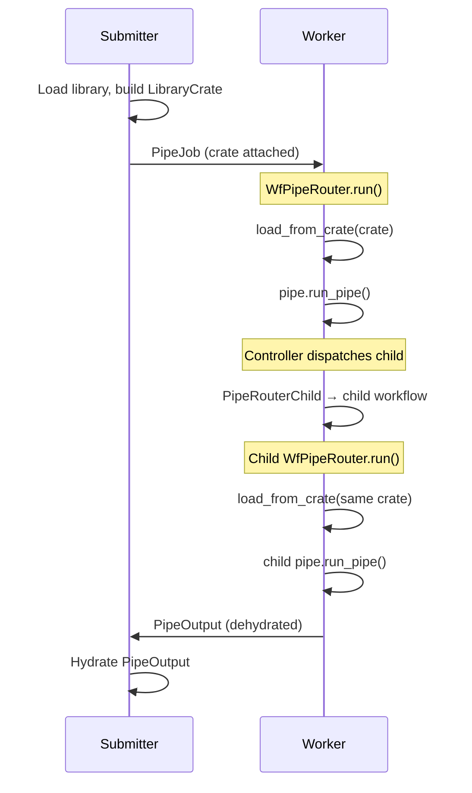

# Temporal Integration

This page is for contributors working on Pipelex internals. If you're deploying or operating Pipelex on Temporal, see the user-facing [Distributed Execution with Temporal](../distributed-execution/temporal/index.md) guide instead.

This page covers the Temporal-specific mechanisms that enable distributed pipe execution. For the general pipe routing architecture (shared between direct and distributed modes), see [Pipe Routing & Execution](./pipe-routing-and-execution.md).

---

## The Three Challenges

Distributing pipe execution across separate worker processes introduces three challenges that don't exist in direct (single-process) mode:

1. **Pipe resolution** — Controllers call `get_required_pipe()` to resolve child pipes. The worker's library must contain those pipes.
2. **Dynamic class deserialization** — `.mthds` bundles generate Python classes at runtime (e.g., `RawText` inheriting from `TextContent`). The worker must have those classes registered before deserializing `WorkingMemory`.
3. **Concurrent isolation** — Multiple workflows running on the same worker may define conflicting class/pipe names. Each workflow needs its own scoped registry and library.

These are solved by three mechanisms: LibraryCrate propagation, deferred hydration, and per-workflow scoping.

---

## LibraryCrate

A `LibraryCrate` is a serializable snapshot of the library — two flat dicts of blueprints:

```python
class LibraryCrate(BaseModel):
    concepts: dict[str, ConceptBlueprint | str]  # concept_ref -> blueprint or description
    pipes: dict[str, PipeBlueprintUnion]          # pipe_ref -> blueprint
    domains: dict[str, DomainBlueprint]           # domain_code -> domain metadata
    source_map: dict[str, str]                    # ref -> source file (error traceability)
    fingerprint: str                              # SHA256 of serialized content
```

Domain is encoded in the dictionary keys (e.g., `scoring.WeightedScore`, `scoring.compute_score`), not in a structural container. `domains` carries per-domain metadata (description, system prompt). `source_map` enables error messages that trace back to origin files. The `fingerprint` enables idempotent loading — if a worker already loaded a crate with the same fingerprint, it skips the reload.

### How it propagates



Every child workflow receives the crate through its `PipeJob`. Each `WfPipeRouter` loads the crate into its own scoped library. This ensures every workflow — parent or child, on any worker — can resolve all pipes.

### Visibility

The `LibraryCrate` is a Pydantic model. Temporal serializes it as structured JSON in the workflow input, making it fully visible in the Temporal dashboard — not opaque bytes.

---

## Deferred Hydration

### The chicken-and-egg problem

Temporal's data converter deserializes payloads (workflow inputs and return values) using Kajson, which needs dynamic concept classes registered to reconstruct typed `WorkingMemory`. But those classes only get registered when the `LibraryCrate` is loaded inside the workflow. This creates two deserialization gaps:

1. **Input**: The `PipeJob` workflow input contains `WorkingMemory` with dynamic classes that don't exist yet on the worker.
2. **Output**: A child workflow's `PipeOutput` return value contains `WorkingMemory` with dynamic classes. The parent's data converter runs in the Temporal SDK's event processing context (outside the workflow coroutine's `ContextVar` scope), so it can't access the parent's per-workflow class registry.

### The solution

Both `PipeJob` and `PipeOutput` carry a `working_memory_raw` field for deferred hydration:

```python
class PipeJob(BaseModel):
    working_memory: WorkingMemory | None = None
    working_memory_raw: dict[str, Any] | None = None
    library_crate: LibraryCrate | None = None

class PipeOutput(PipeOutputAbstract[WorkingMemory]):
    working_memory: WorkingMemory = Field(default_factory=WorkingMemory)
    working_memory_raw: dict[str, Any] | None = None
```

**Input dehydration/hydration cycle:**

- Before dispatch, `PipeJob.prepare_for_temporal()` moves `working_memory` to `working_memory_raw` (a plain dict via `dump_for_temporal()`).
- After the worker loads the crate, `WfPipeRouter` hydrates the raw dict back to typed `WorkingMemory`.

**Output dehydration/hydration cycle:**

- Before returning from a workflow, `WfPipeRouter` calls `PipeOutput.prepare_for_temporal()` to dehydrate `WorkingMemory` to `working_memory_raw`.
- The raw dict flows **end-to-end**: child workflow → parent `WfPipeRun` → `act_deliver` activity, all without intermediate rehydration. Parents do not own a per-workflow registry that would let them rehydrate the child's output, and the activity worker is typically a different process that has not loaded the crate.
- Only the **top-level submitter** rehydrates, via `rehydrate_pipe_output_with_crate()` (`pipelex/temporal/tprl_pipe/submitter_hydration.py`). When the submitter has not loaded the bundle locally (e.g., a remote API client that built the `PipeJob` from a serialized `LibraryCrate`), this function opens a fresh per-call scoped Library, loads the crate into a scoped `ClassRegistry` pre-seeded from the global, hydrates inside the scope, then tears down — leaving the submitter's global registry untouched.

The hydration function (`pipelex/temporal/tprl_pipe/hydration.py`) iterates the raw dict, uses `StuffContentFactory` to reconstruct typed content objects using the registered classes, and preserves aliases. It also includes a small but unintuitive guard (`_validate_as_known_class`) that round-trips items through `model_dump()` to defeat cross-exec class-identity mismatches: kajson may eagerly rebuild instances using one class identity, then `load_from_crate` re-execs the source and replaces the registry entry with a new identity (same name, different `id()`), which would otherwise cause Pydantic's `model_validate` to reject the older instance.

### Why output dehydration goes end-to-end

Earlier designs had the parent `WfPipeRun` rehydrate the child's `PipeOutput` before scheduling `act_deliver`, then propagated dynamic classes from the per-workflow registry into the worker's global `KajsonManager` registry so the activity worker could decode the typed payload. This worked on a single worker but broke under distributed Temporal: any worker polling the task queue can pick up the activity, and `ContextVars` / per-worker globals do not cross processes. The current design eliminates that hack — `act_deliver` receives the raw dict directly, never needs class resolution for transport, and the activity worker does not need the crate loaded.

### Activity-side rendering of the raw working memory

`act_deliver` cannot assume dynamic concept classes are registered on its worker. `DeliveryExecutor.generate_result_files()` (`pipelex/pipe_run/delivery_executor.py`) therefore branches on which field is populated:

- **Typed path** (`working_memory` set, in-process / same-worker): existing typed renderers run unchanged.
- **Raw path** (`working_memory_raw` set, cross-process Temporal): `working_memory.json` is written directly from the raw dict; for the main stuff, `try_local_hydrate_stuff()` attempts a single-Stuff hydration using only globally registered classes (built-in `StuffContent` subclasses are always present). On success, typed renderers produce `main_stuff.{md,html}` and the viewer; on miss (dynamic concept class not registered locally), a generic field-walking fallback renders JSON-in-markdown and `<pre>`-in-HTML so users still get readable output. Misses log a warning so silent regressions on built-in hydration surface.

Tradeoff: dynamic concepts lose typed rendering on the activity worker, but the activity worker no longer needs the crate, which is the precondition for true distributed execution.

### Boundary-by-boundary summary

| Boundary | Direction | What crosses | Hydration on receive? |
|----------|-----------|--------------|------------------------|
| Submitter → top `WfPipeRouter` | input | `PipeJob` with `working_memory_raw` + `library_crate` | Yes — worker loads crate, then hydrates inside scope |
| Parent `WfPipeRouter` → child `WfPipeRouter` | input | Same `PipeJob` shape (crate re-loaded idempotently via fingerprint) | Yes — child worker loads crate, hydrates inside its own scope |
| Child `WfPipeRouter` → parent `WfPipeRun` | output | `PipeOutput` with `working_memory_raw` | **No** — parent forwards raw dict |
| Parent `WfPipeRun` → `act_deliver` | activity arg | `PipeOutput` with `working_memory_raw` (no crate) | **No** — activity renders from raw, with best-effort local hydration of the main stuff using only globally registered classes |
| Top `WfPipeRouter` → submitter | output | `PipeOutput` with `working_memory_raw` | Yes — `rehydrate_pipe_output_with_crate()` opens a fresh scoped Library if a crate is available, otherwise falls back to the global registry |

### Dashboard visibility

`working_memory_raw` is a plain JSON dict — fully readable in the Temporal dashboard without needing class resolution.

---

## Per-Workflow Scoping

### Why per-workflow isolation matters

A single Temporal worker may process multiple concurrent workflows. If two workflows define a concept named `Result` with different structures (e.g., `Result(score, label)` vs `Result(value, confidence, is_valid)`), they must not share the same `ClassRegistry` or `Library`. Without isolation, the second workflow's class registration would overwrite the first's, causing silent data corruption.

### How it works

Each `WfPipeRouter.run()` creates its own scoped state:

1. **ClassRegistry**: A new `ClassRegistry` pre-seeded from the global registry (which has base classes from `PIPELEXPATH`). Dynamic classes from the crate are registered here — not in the global registry.

2. **Library**: A new `Library` instance opened via `library_manager.open_fresh_library()`, with the `ClassRegistry` attached as a `PrivateAttr`. The library is set as the current library via the `_library_id` `ContextVar`. The library id is keyed by the run id (`wf_{run_id}`) — replay-stable but unique per run. Keying by workflow id would collide across runs of a reused workflow id (workflow-level retry policy, Temporal reset, resubmission of the same `pipeline_run_id`): a closed predecessor run's late eviction cleanup could tear down a live successor run's library on the same worker. With run-id keying, a pre-existing library under the id can only be this same run's own leftover (an interrupted execution whose cleanup never ran), so `open_fresh_library` tears it down before opening: reusing it would fingerprint-skip the crate load against the fresh registry — the crate's dynamic classes would never land in it. The stale teardown is best-effort: the manager forgets the entry pop-first, and a raising teardown is logged and never fails the fresh open (worker-local leak state must not decide setup success). The same run-id keying applies to the rest of the per-run worker-local state: the graph tracer key and the report-delegate event-log context key.

3. **ClassRegistry lookup chain**: `hub.get_class_registry()` reads `_library_id` from the `ContextVar`, gets the library's attached `ClassRegistry`. Falls back to the global registry if no library is set.

4. **Cleanup**: `library_manager.teardown(library_id)` deletes the library and its `ClassRegistry`. The `ContextVar` is reset via `clear_current_library()`. No manual GC needed — the `ClassRegistry` is garbage-collected with the `Library`. In the workflow's `finally` block, this worker-local cleanup runs BEFORE the awaited `act_flush_trace_events` activity: the await is a suspension point where an eviction-time `BaseException` can abort the rest of the block, so ordering cleanup first guarantees an eviction can only skip the flush itself, never the teardown.

### Kajson integration

The Temporal data converter passes the active `ClassRegistry` to `kajson.loads()`:

```python
pydantic_gizmo = kajson.loads(data, class_registry=get_class_registry())
```

Inside a workflow coroutine, `get_class_registry()` returns the per-workflow scoped registry (via `_library_id` ContextVar). However, the data converter is also called from the Temporal SDK's event processing context (e.g., when deserializing child workflow return values), where the ContextVar is not set. In that case, it falls back to the global registry. This is why PipeOutput uses deferred hydration — the `working_memory_raw` dict doesn't require class resolution during deserialization.

---

## Workflow Topology

A single pipe execution can create many Temporal workflows. Each level of nesting dispatches child workflows:

```
PipeSequence (3 steps)
  → 1 parent WfPipeRouter
  → 3 child WfPipeRouters (one per step)
  Each child step (if PipeLLM):
    → 1 act_llm_gen_text activity (dispatched directly from WfPipeRouter
       via ContentGeneratorInWorkflow.make_llm_text)

PipeParallel (2 branches, then summary)
  → 1 parent WfPipeRouter
  → 3 child WfPipeRouters (2 branches concurrent + 1 summary)

PipeBatch (3 items)
  → 1 parent WfPipeRouter
  → 1 child WfPipeRouter for the PipeBatch controller
  → 3 child WfPipeRouters (one per item)
```

Each `WfPipeRouter` loads the `LibraryCrate` (idempotent via fingerprint), so pipe resolution works at every level.

---

## Controller Dispatch Patterns on Temporal

Each controller type creates a different child workflow pattern:

| Controller | Dispatch pattern | Child workflows |
|------------|-----------------|----------------|
| **PipeSequence** | Sequential: each step via `SubPipe.run_pipe()` → `PipeRouterChild` | N children (one per step), executed sequentially |
| **PipeParallel** | Concurrent: all branches via `SubPipe.run_pipe()` + `asyncio.gather()` | N children (one per branch), executed concurrently |
| **PipeBatch** | Fan-out: each list item via `SubPipe.run_pipe()` | N children (one per item), executed concurrently |
| **PipeCondition** | Conditional: evaluates expression, dispatches selected outcome via `SubPipe.run_pipe()` | 1 child (the chosen outcome pipe), plus an internal `act_jinja2_gen_text` activity for expression evaluation |

### Internal templating activities

Some controllers dispatch internal `act_jinja2_gen_text` activities in addition to pipe routing:

- **PipeCondition**: `act_jinja2_gen_text` to evaluate the expression template against working memory
- **PipeCompose**: `act_jinja2_gen_text` to resolve construct field references (e.g., `{ from = "title_text.text" }`)

Both call `ContentGeneratorInWorkflow.make_templated_text` from inside `WfPipeRouter`, which dispatches the activity directly via `workflow.execute_activity(act_jinja2_gen_text, ...)`. These activities carry working memory contents through the Temporal data converter, which creates a serialization dependency on working memory content types.

---

## Validation Dispatch: One In-Process Activity

Pipeline *execution* fans out across workflows and activities as described above — but *validation* deliberately does the opposite. When Temporal is enabled, a `/validate` job (validation sweep + graph-producing dry-run) dispatches as the one-step wrapper workflow `wf_dry_validate`, which runs a single `act_dry_validate` activity and returns `{per-pipe status map, GraphSpec | None}` in one round-trip.

Inside the activity everything is in-process and in-memory:

- The library is loaded once: the sweep half is `validate_bundle` itself (the same function the direct-mode route calls, so both backends share the categorized `ValidateBundleError` contract), which leaves the library loaded; the graph dry-run (`dry_run_pipe_in_process`) runs against that same library; teardown happens once in the activity's `finally`.
- ContextVar scopes pin the run in-process: `scoped_pipe_router` (nested controller sub-pipes resolve a local router, not the `TemporalPipeRouter`), `scoped_content_generator` (inference leaves resolve an inline dry generator, not `ContentGeneratorInWorkflow`), and `scoped_event_log` (the graph traces into a shared `InMemoryEventLog` — no NDJSON file, no DynamoDB round-trip; the `GraphSpec` rides back on the activity result). No usage/cost events are emitted.
- The graph is best-effort: an expected dry-run failure (the run-failure wrappers, or a mock-input mint failure) returns `graph_spec=None` with validation still successful; any other error propagates and fails the activity.
- Validation failures cross the boundary as structured `ErrorReport`s via the activity error boundary — a strict-mode `SignaturesNotAllowedError` keeps its offending-pipe and signature refs, so the API can render a meaningful 422.

Submitters call `dispatch_dry_validate` (`pipelex/temporal/tprl_pipe/dry_validate_dispatch.py`) for the whole round-trip. The wrapper workflow exists so the dispatch works on the current `temporalio` SDK; replacing it with a true standalone activity is a deferred optimization.

---

## Known Limitation: StuffArtefact Serialization in Dry-Run

In dry-run mode, PipeLLM produces `StuffArtefact` debug objects as working memory content. When controllers dispatch internal templating activities that carry working memory contents through the Temporal data converter, Kajson fails with `TypeError: Type <class 'StuffArtefact'> is not JSON serializable`.

`StuffArtefact` is not a Pydantic model — it's a plain object used for dry-run tracing that was never designed for cross-process serialization.

**Confirmed affected**:

- **PipeCondition**: expression evaluation dispatches `act_jinja2_gen_text`, which serializes working memory to evaluate the Jinja2 expression. Fails with `StuffArtefact` TypeError.
- **PipeCompose**: construct field resolution dispatches `act_jinja2_gen_text` similarly.

**Likely affected** (hangs in testing, root cause not fully diagnosed):

- **PipeBatch**: fan-out creates child PipeJobs with copies of working memory. The hang may be caused by `StuffArtefact` in the serialized child PipeJob, or by a different serialization issue in the list content extraction.

**Not affected**:

- **PipeSequence**: no internal templating activities — child pipes are dispatched via `SubPipe.run_pipe()` → `PipeRouterChild`, which creates clean child PipeJobs.
- **PipeParallel**: same dispatch pattern as PipeSequence — branches go through `SubPipe.run_pipe()` without internal templating activities.
- **All controllers in live mode**: `StuffArtefact` is only produced in dry-run. Live execution uses real content objects that serialize correctly.

**Fix direction**: Either make `StuffArtefact` serializable (implement `__json__` or convert to Pydantic), or strip non-serializable objects from working memory before passing to internal templating activities.

---

## File Reference

| Component | File |
|-----------|------|
| LibraryCrate model | `pipelex/libraries/library_crate.py` |
| LibraryCrate factory | `pipelex/libraries/library_crate_factory.py` |
| PipeJob (crate + raw WM fields) | `pipelex/pipe_run/pipe_job.py` |
| PipeOutput (raw WM for deferred hydration) | `pipelex/core/pipes/pipe_output.py` |
| PipeRouterTop (submitter-side dispatch) | `pipelex/temporal/tprl_pipe/pipe_router_top.py` |
| PipeRouterChild (worker-side child dispatch) | `pipelex/temporal/tprl_pipe/pipe_router_child.py` |
| WfPipeRouter (workflow entry point) | `pipelex/temporal/tprl_pipe/wf_pipe_router.py` |
| Deferred hydration (worker-side) | `pipelex/temporal/tprl_pipe/hydration.py` |
| Submitter-side rehydration | `pipelex/temporal/tprl_pipe/submitter_hydration.py` |
| Activity-side delivery rendering (typed/raw dual path) | `pipelex/pipe_run/delivery_executor.py` |
| WorkingMemory dehydration helper | `pipelex/core/memory/working_memory.py` (`dump_for_temporal`) |
| Kajson data converter | `pipelex/temporal/temporal_data_converter.py` |
| Hub (ClassRegistry + Library scoping) | `pipelex/hub.py` |
| Library (PrivateAttr ClassRegistry) | `pipelex/libraries/library.py` |
| Worker CLI | `pipelex/temporal/worker_cli.py` |
| Temporal task manager | `pipelex/temporal/temporal_task_manager.py` |
