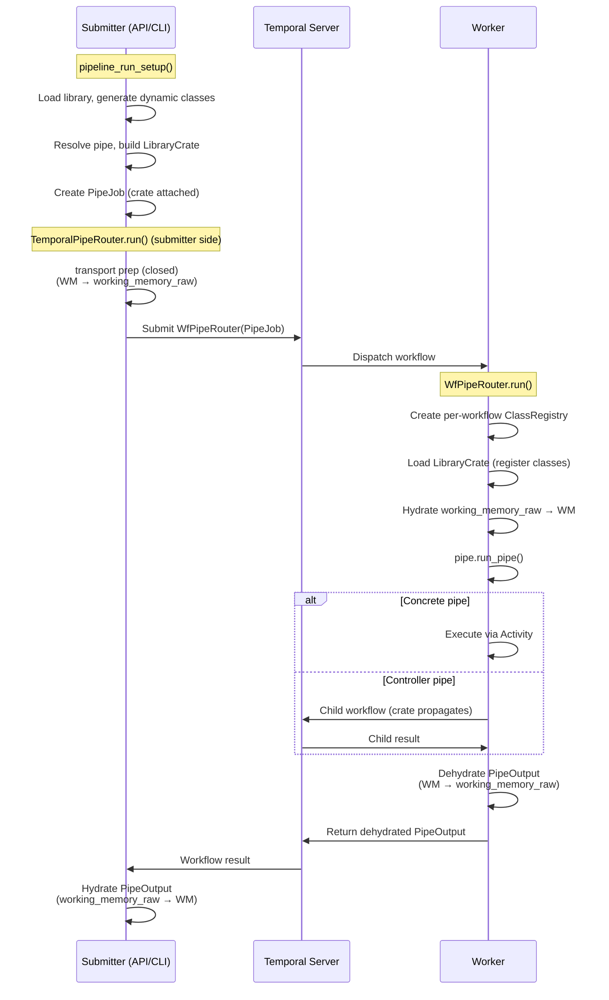
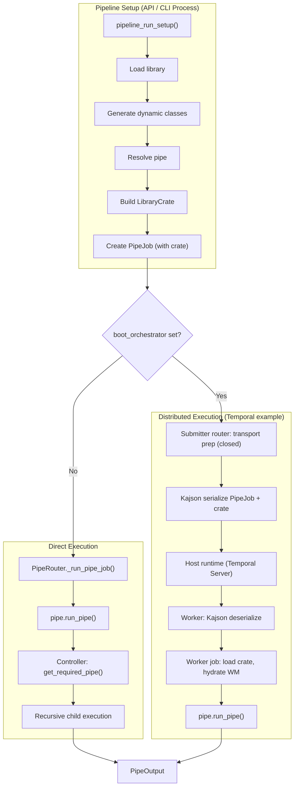

# Pipe Routing & Execution

Pipelex runs pipes either **direct** (single-process) or **distributed** on a host runtime. Both share the same pipe definitions, library loading, and controller logic. The key difference is *where* the pipe runs and how the PipeJob travels to get there. The distributed host runtime is a durable backend — Temporal-backed execution or a Mistral Workflows integration — delivered through the Pipelex platform (see [Distributed Execution](../distributed-execution/index.md)). Both reach pipe execution through the same framework-agnostic runtime bridge.

---

## Terminology

| Term | Meaning |
|------|---------|
| **Direct execution** | All pipes run in the same Python process. Library, class registry, and pipe resolution are shared in-memory. |
| **Distributed execution** | PipeJob is serialized and sent to a remote worker — a Pipelex Temporal worker, or a Mistral Workflows activity. The worker is a separate process (potentially on a different machine). |

---

!!! note "The runtime bridge"
    Both distributed paths reach pipe execution through the framework-agnostic runtime bridge. The open `pipelex/runtime_bridge/` keeps the boot, serialization, mode/delivery, and worker-side hydration (`primitives/hydration.py`) pieces; the cross-process **dispatch** primitives — classifying controller pipes as child workflows and leaf operators as activities (`pipe_classification`), flushing trace events (`trace_flush`), and delivering results (`delivery`) — were extracted into the closed `pipelex-transport` library, which both commercial host-runtime plugins import. Graph and token-usage assembly is not a bridge primitive — it lives in `pipelex/pipe_run/tracing_assembly.py` and runs the same way for local and distributed runs.

---

## Design Principle

Every pipe execution — regardless of mode — follows the same pattern:

1. **Setup**: `pipeline_run_setup()` loads the library, resolves the pipe, initializes working memory, and creates a `PipeJob`
2. **Route**: A router (`PipeRouter` for direct mode, or the booted orchestrator's distributed router) receives the PipeJob and dispatches it
3. **Execute**: The pipe's `run_pipe()` method runs, potentially resolving and executing child pipes

The `PipeJob` is the universal unit of execution. It carries everything needed to run a single pipe.

---

## The PipeJob Model

`PipeJob` encapsulates all information needed to execute a pipe.

| Field | Type | Purpose |
|-------|------|---------|
| `pipe` | `PipeAbstract` | The resolved pipe object (concrete operator or controller) |
| `working_memory` | `WorkingMemory \| None` | Runtime data store — typed `Stuff` objects keyed by variable name |
| `working_memory_raw` | `dict \| None` | Raw JSON dict of WorkingMemory for deferred hydration (Temporal only) |
| `pipe_run_params` | `PipeRunParams` | Execution config: run mode (LIVE/DRY), output multiplicity, pipe stack for cycle detection |
| `job_metadata` | `JobMetadata` | Pipeline run ID, user ID, OTel tracing context, graph tracing context |
| `output_name` | `str \| None` | Override for the output variable name |
| `library_crate` | `LibraryCrate \| None` | Serializable library snapshot for distributed execution |

`PipeJob` is created by `pipeline_run_setup()`, which handles library loading, pipe resolution, working memory initialization, and telemetry setup. For distributed dispatch, a transport-prep step in the closed `pipelex-transport` library moves `working_memory` to `working_memory_raw` (deferred hydration) and ensures the crate is attached.

---

## Library Loading

Before a pipe can execute, the **library** must be loaded. The library contains:

- **Pipes** — all pipe definitions (operators and controllers), resolved by code via `get_required_pipe()`
- **Concepts** — semantic type definitions that determine what data a `Stuff` object holds
- **Domains** — namespaces that group related pipes and concepts

### Base vs Custom Libraries

- **Base libraries** are loaded from directories listed in `PIPELEXPATH`. They contain shared pipe/concept definitions available to all executions.
- **Custom bundles** are per-request `mthds_content` strings. Each API call can bring its own definitions.

### Dynamic Class Generation

When a `.mthds` file declares a concept like `RawText = "Raw input text..."`, the library loading process:

1. `ConceptFactory._handle_basic_blueprint()` detects the concept declaration
2. `StructureGenerator.generate_from_structure_blueprint()` dynamically creates a Python class (e.g., `RawText` inheriting from `TextContent`)
3. The class is registered with the active `ClassRegistry` (accessed via `hub.get_class_registry()`) so it can be serialized/deserialized

These dynamically-generated classes become the `content` type of `Stuff` objects in `WorkingMemory`.

!!! info "Why Dynamic Classes Matter"
    When `WorkingMemory` crosses to a Temporal worker, `dump_for_transport()` stamps content with pipelex-private `__pipelex_class__` / `__pipelex_module__` markers instead of Kajson's `__class__` / `__module__` — deliberately keeping Kajson's universal decoder out of the loop at the data-converter boundary. Pipelex's hydrator resolves those markers against the per-workflow `ClassRegistry`, the only place these dynamic concept classes are registered.

---

## Direct Execution

In direct execution, everything runs in a single Python process. This is the default mode when no orchestrator plugin is booted.

### Flow

```
pipeline_run_setup()
  ├── Load library (library_manager singleton)
  ├── Generate dynamic concept classes
  ├── Register classes with Kajson
  ├── Resolve pipe via get_required_pipe(pipe_code)
  ├── Initialize WorkingMemory from inputs
  └── Return PipeJob

PipeRouter.run(pipe_job)
  ├── Notify observers (before)
  ├── _run_pipe_job(pipe_job)
  │   └── pipe_job.pipe.run_pipe(...)     ← delegates directly to the pipe
  │       ├── Concrete pipe: execute operator logic (LLM call, template, etc.)
  │       └── Controller: resolve child pipes via get_required_pipe(),
  │           then recursively call child.run_pipe()
  ├── Notify observers (after)
  └── Return PipeOutput
```

### Router Selection

The router is selected during `Pipelex.setup()` by resolving the hub's `PIPE_ROUTER` slot. A boot-orchestrator plugin (e.g. the closed `pipelex-temporal` plugin) claims that slot in its `register()` when `plugins.boot_orchestrator` names it; otherwise the default in-process router is used:

```python
# A boot-orchestrator plugin swaps in its distributed router when
# plugins.boot_orchestrator == its own name; otherwise this default runs.
effective_pipe_router = self._resolve_hub_slot(
    slot=HubSlot.PIPE_ROUTER,
    default=lambda: PipeRouter(observer=multi_observer),   # Direct, in-process
)
```

### How PipeRouter Works

`PipeRouter` implements `PipeRouterProtocol` with a minimal `_run_pipe_job()`:

```python
async def _run_pipe_job(self, pipe_job: PipeJob) -> PipeOutput:
    return await pipe_job.pipe.run_pipe(
        job_metadata=pipe_job.job_metadata,
        working_memory=pipe_job.get_working_memory(),
        output_name=pipe_job.output_name,
        pipe_run_params=pipe_job.pipe_run_params,
        library_crate=pipe_job.library_crate,
    )
```

The router does not route by pipe type — it delegates to the pipe itself. Controllers handle their own orchestration internally.

---

## Pipe Controllers

Controllers are pipes that orchestrate the execution of other pipes. They resolve child pipes at runtime via `get_required_pipe()` from the library.

| Controller | Behavior |
|------------|----------|
| **PipeSequence** | Executes `sequential_sub_pipes` one after another. Each step receives working memory with outputs from previous steps. |
| **PipeBatch** | Iterates over a `ListContent` input. For each item, loads `branch_pipe` and executes it with a deep copy of working memory. Items run concurrently via asyncio. |
| **PipeCondition** | Evaluates a Jinja2 `expression` against working memory, maps the result via `outcome_map` to a pipe code, and executes that pipe. |
| **PipeParallel** | Loads multiple child pipes and executes them concurrently, each with its own working memory copy. |

All controllers follow the same pattern:

1. Call `get_required_pipe(child_pipe_code)` to resolve the child pipe from the library
2. Route through `get_pipe_router().run(PipeJob(...))` — the hub auto-selects the right router
3. Aggregate results into working memory or output

### Auto-Switching Router

The hub (`get_pipe_router()`) returns the router for whichever orchestrator the process is booted under:

- **Direct execution**: the in-process `PipeRouter` — child pipes run in the same process.
- **Distributed execution**: the booted host-runtime orchestrator's router, which has claimed the hub's `PIPE_ROUTER` slot. That router auto-detects whether it is dispatching from the **submitter** (start a top-level workflow) or from **inside a running workflow** (start a child workflow). Pipelex's Temporal backend realizes this as `TemporalPipeRouter`, which picks `execute_workflow` vs `execute_child_workflow` accordingly.

This means each child pipe in a controller gets its own workflow boundary in distributed mode — enabling independent retries, separate worker assignment, and per-pipe visibility in the host runtime's UI.

!!! note "Library Dependency"
    Controllers depend on the library being loaded in the current process. `get_required_pipe()` queries the library scoped to the current run via `ContextVar`, which must have been populated by loading a `LibraryCrate`. In distributed execution, each worker-side job loads the crate from the `PipeJob` into a per-run `Library` instance before resolving child pipes. (Temporal-specific detail: the backend disables the Temporal sandbox via `--no-sandbox` because library loading is a side effect incompatible with replay semantics.) See [Runtime Bridge & Transport](./runtime-bridge-and-transport.md) for how the crate and working memory cross the boundary.

---

## Distributed Execution

In distributed execution, the PipeJob is serialized and sent to a host-runtime worker for execution. The concrete dispatch shape below is illustrated with Pipelex's [Temporal backend](https://pipelex.com/products#temporal); the boundary mechanics (LibraryCrate, deferred hydration, per-call isolation) are backend-neutral and documented in [Runtime Bridge & Transport](./runtime-bridge-and-transport.md).

### Flow



### Key components (the backend's role)

A host-runtime orchestrator supplies the pieces that turn this generic shape into real workflows. The contract each implements is open core; the concrete classes are backend-specific. In Pipelex's Temporal backend:

- a **router** implementing `PipeRouterProtocol` (`TemporalPipeRouter`) that dispatches via Temporal instead of running in-process;
- a **worker-side job** (a Temporal workflow) that receives a deserialized `PipeJob`, loads the crate, hydrates working memory, and calls `pipe.run_pipe()` — exactly like the direct router;
- a **data converter** that uses Kajson to (de)serialize Pydantic models with subclass types preserved — critical because `PipeJob.pipe` is a `PipeAbstract` subclass and `WorkingMemory` holds `Stuff` objects with concept-specific content classes;
- a **worker entry point** that calls `Pipelex.make(boot_orchestrator="temporal")` and starts the worker with its registered workflows and activities (shipped as the `pipelex-temporal worker` console command).

The concrete modules live in the closed `pipelex-temporal` plugin (`pipelex_temporal/...`), documented in that repo. The open contracts they satisfy — `PipeRouterProtocol`, the boundary DTOs, serialization — are listed in the [Orchestrator SPI](./orchestrator-plugins.md#the-orchestrator-spi).

### Content generation activities

Concrete pipe operators (PipeLLM, PipeCompose, PipeExtract, PipeImgGen) dispatch their actual leaf work as host-runtime activities, invoked from inside the worker-side job via the runtime's in-workflow content generator — no intermediate child workflow per content-generation call. A backend can route those activities to different task queues per activity (and, where applicable, per handle); in the Temporal backend that routing is configured under the plugin's own `[worker_config.activity_queues]` config (in the plugin's `temporal.toml`, not core config), falling back to the job's own task queue when unset. The concrete activity set and queue-routing reference live in the `pipelex-temporal` plugin's docs; see also [Content Generation Across Boundaries](./distributed-content-generation.md) for the backend-neutral serialization mechanism.

!!! note "Future Improvement: Per-Pipe Routing"
    Router selection is currently global and binary: either all pipes go through the distributed backend, or none do. A simple `PipeCompose` (microseconds of Jinja2 rendering) gets the same dispatch overhead as a `PipeLLM` (minutes of API call time). Per-pipe or per-type routing decisions could improve efficiency.

---

## Crossing the boundary: crate, hydration, isolation

Distributed execution introduces three mechanisms that don't exist in direct mode, because the worker is a separate process that shares none of the submitter's library, class registry, or working-memory state. They are backend-neutral; for the full walkthrough see [Runtime Bridge & Transport](./runtime-bridge-and-transport.md). In short:

- **LibraryCrate propagation** — the submitter attaches a serializable snapshot of all pipes and concepts to the `PipeJob`; every worker-side job loads it (idempotently, by fingerprint) so `get_required_pipe()` resolves at every level.
- **Deferred hydration** — `WorkingMemory` crosses as a raw JSON dict (`working_memory_raw`) on both `PipeJob` inputs and `PipeOutput` return values, avoiding deserialization failures when a receiving process hasn't registered the bundle's dynamic concept classes. The transport-prep helpers live in the closed `pipelex-transport` library; the raw field and the hydration helper stay in open core.
- **Per-call isolation** — each job gets its own `ClassRegistry` (pre-seeded from the global registry) and its own `Library`, scoped via `ContextVar`, so concurrent jobs with conflicting concept names (e.g., two bundles that both define `Result` with different fields) don't cross-contaminate.

!!! warning "Known backend limitation: StuffArtefact in dry-run"
    On a host runtime whose data converter serializes working memory for internal templating activities (Temporal's `act_jinja2_gen_text`, dispatched by PipeCondition and PipeCompose), dry-run mode can fail: working memory then holds `StuffArtefact` debug objects that are not JSON-serializable. PipeSequence and PipeParallel are unaffected — they dispatch child pipes without internal templating activities. This is a backend-specific concern; see the `pipelex-temporal` plugin docs for details and fix direction.

---

## Architecture Diagram



---

## File Reference

| Component | File |
|-----------|------|
| PipeJob model | `pipelex/pipe_run/pipe_job.py` |
| Pipeline setup | `pipelex/pipeline/pipeline_run_setup.py` |
| PipeRouter (direct) | `pipelex/pipe_run/pipe_router.py` |
| PipeRouterProtocol | `pipelex/pipe_run/pipe_router_protocol.py` |
| Distributed router / worker job / data converter / worker CLI | backend-specific — in the host-runtime plugin (e.g. `pipelex_temporal/...`), not open core |
| Library manager | `pipelex/libraries/library_manager.py` |
| ConceptFactory | `pipelex/core/concepts/concept_factory.py` |
| StructureGenerator | `pipelex/core/concepts/structure_generation/generator.py` |
| LibraryCrate model | `pipelex/libraries/library_crate.py` |
| LibraryCrate factory | `pipelex/libraries/library_crate_factory.py` |
| Deferred hydration utility (open core) | `pipelex/runtime_bridge/primitives/hydration.py` |
| Hub (get_required_pipe, get_class_registry) | `pipelex/hub.py` |
| PipeSequence | `pipelex/pipe_controllers/sequence/pipe_sequence.py` |
| PipeCondition | `pipelex/pipe_controllers/condition/pipe_condition.py` |
| PipeBatch | `pipelex/pipe_controllers/batch/pipe_batch.py` |
| PipeParallel | `pipelex/pipe_controllers/parallel/pipe_parallel.py` |
| Router selection | `pipelex/pipelex.py` (in `Pipelex.setup()`) |
