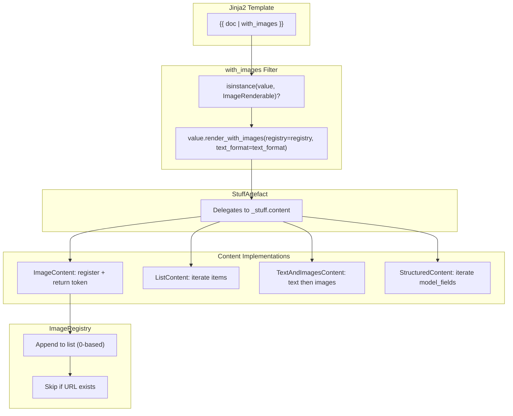

# StuffArtefact & Image Rendering

StuffArtefact is a thin delegation adapter that wraps `Stuff` objects for Jinja2 template access. The `ImageRenderable` protocol enables image extraction from nested content without circular imports between the template layer and domain layer.

---

## Design Principle

Two problems, one pattern:

1. **Template Access**: Templates need to access content fields via `{{ my_stuff.field_name }}` without knowing Pydantic internals
2. **Image Extraction**: The `with_images` filter needs to traverse content hierarchies without importing concrete types

**Solution**: StuffArtefact delegates attribute access to underlying content. ImageRenderable uses `@runtime_checkable` Protocol for duck-typed image extraction.

```
StuffArtefact wraps Stuff → delegates to StuffContent → Protocol enables traversal
```

!!! info "Protocol over Inheritance"
    ImageRenderable uses duck typing. Any class with a `render_with_images()` method satisfies the protocol—no base class required.

---

## Template Access Patterns

| Pattern | Result |
|---------|--------|
| `{{ doc.title }}` | Content field value |
| `{{ doc.pages }}` | Nested content (list, struct, etc.) |
| `{{ doc._stuff_name }}` | Metadata: variable name |
| `{{ doc._content_class }}` | Metadata: content class name |
| `{{ doc._concept_code }}` | Metadata: concept code |
| `{{ doc \| with_images }}` | Text with `[Image N]` tokens |
| `{{ doc \| tag }}` | Tagged output (no images) |

---

## Image Extraction Behavior

| Content Type | `render_with_images()` Behavior |
|-------------|--------------------------------|
| `ImageContent` | Self-registers, returns `[Image N]` |
| `ListContent` | Iterates items, recurses into nested |
| `TextAndImagesContent` | Renders text first, then images |
| `StructuredContent` | Iterates model fields, recurses into nested lists/tuples/dicts |
| `StuffArtefact` | Delegates to underlying content |

---

## Architecture



---

## StuffArtefact Implementation

### Attribute Access Priority

StuffArtefact uses `__getattribute__` to intercept all attribute access:

```python
def __getattribute__(self, key: str) -> Any:
    # 1. Passthrough: _stuff, methods, magic attributes
    if key in _PASSTHROUGH_ATTRS or key.startswith("__"):
        return object.__getattribute__(self, key)

    # 2. Content fields (highest priority for templates)
    content_fields = type(content).model_fields
    if key in content_fields:
        return getattr(content, key)

    # 3. Metadata accessors
    match key:
        case "_stuff_name": return stuff.stuff_name
        case "_content_class": return content.__class__.__name__
        case "_concept_code": return stuff.concept.code
        case "_stuff_code": return stuff.stuff_code
        case "_content": return content

    # 4. Fallback to normal lookup
    return object.__getattribute__(self, key)
```

!!! warning "Content Field Priority"
    Content fields shadow StuffArtefact methods. If your content has a field named `items`, accessing `artefact.items` returns the field value, not the iteration method. Use `artefact.iter_items()` for explicit dict-like iteration.

### Dict-like Access

StuffArtefact supports bracket notation and iteration:

| Method | Purpose |
|--------|---------|
| `artefact["field"]` | Bracket access (via `__getitem__`) |
| `artefact.get("field", default=...)` | Safe access with default |
| `"field" in artefact` | Membership test |
| `artefact.iter_keys()` | Iterate field names |
| `artefact.iter_items()` | Iterate (key, value) pairs |
| `artefact.iter_values()` | Iterate values |

---

## ImageRenderable Protocol

### Definition

```python
from typing import Protocol, runtime_checkable

@runtime_checkable
class ImageRenderable(Protocol):
    """Protocol for types that can render with image extraction."""

    def render_with_images(
        self,
        *,
        registry: ImageRegistry,
        text_format: TextFormat,
    ) -> str:
        """Render to string, registering images to the registry.

        Returns:
            String with [Image N] tokens where images appear.
        """
        ...
```

### Why Protocol?

- **Avoids circular imports**: `tools/jinja2/` can check types from `core/stuffs/` without importing them
- **Duck typing**: No inheritance required—any matching method signature works
- **Runtime checking**: `isinstance(value, ImageRenderable)` works at runtime

---

## Content Implementations

### ImageContent

Self-registers and returns a token:

```python
def render_with_images(self, *, registry, text_format) -> str:
    image_index = registry.register_image(self)
    return f"[Image {image_index + 1}]"
```

### ListContent

Iterates items, delegating to nested ImageRenderable objects:

```python
def render_with_images(self, *, registry, text_format) -> str:
    parts: list[str] = []
    for item in self.items:
        if isinstance(item, ImageRenderable):
            rendered = item.render_with_images(registry=registry, text_format=text_format)
        else:
            rendered = item.rendered_markdown()
        if rendered:
            parts.append(rendered)
    return "\n".join(parts)
```

### TextAndImagesContent

Renders text first, then registers each image:

```python
def render_with_images(self, *, registry, text_format) -> str:
    parts: list[str] = []
    if self.text:
        parts.append(self.text.rendered_for_prompt(text_format=text_format))
    if self.images:
        for image in self.images:
            image_index = registry.register_image(image)
            parts.append(f"[Image {image_index + 1}]")
    return "\n".join(parts)
```

### StructuredContent

Default implementation for structured models iterates Pydantic model fields:

```python
def render_with_images(self, *, registry, text_format) -> str:
    parts: list[str] = []
    for field_name in type(self).model_fields:
        field_value = getattr(self, field_name)
        if field_value is None:
            continue
        rendered = self._render_value_with_images(field_value, registry=registry, text_format=text_format)
        if rendered:
            parts.append(f"{field_name}: {rendered}")
    return "\n".join(parts)
```

The `_render_value_with_images` helper recurses: a nested `ImageRenderable` gets `render_with_images(...)`, plain lists/tuples/dicts are traversed item by item, a non-renderable `StuffContent` falls back to `rendered_for_prompt(text_format=text_format)`, and anything else to `str(value)`. A plain `StuffContent` subclass that is not a `StructuredContent` does not implement the protocol.

---

## Image Numbering

### Registry Behavior

| Operation | Result |
|-----------|--------|
| First image registered | Returns index `0` |
| Second image registered | Returns index `1` |
| Same URL registered again | Returns existing index (deduplication) |
| Display in template | `[Image {index + 1}]` (1-based) |

### Example

```python
registry = ImageRegistry()

idx = registry.register_image(img_a)  # idx=0 → [Image 1]
idx = registry.register_image(img_b)  # idx=1 → [Image 2]
idx = registry.register_image(img_a)  # idx=0 → [Image 1] (same URL)

len(registry.images)  # 2 (deduplicated)
```

---

## The `with_images` Filter

### Execution Flow

```python
@pass_context
def with_images(context: Context, value: Any, _: Any = None) -> str:
    # 1. Validate input
    if isinstance(value, Undefined):
        raise Jinja2ContextError("Cannot use with_images on undefined")

    # 2. Get/create registry from context
    registry = context.get(Jinja2ContextKey.IMAGE_REGISTRY)
    if registry is None:
        registry = ImageRegistry()

    # 3. Get text format
    text_format = TextFormat(context.get(Jinja2ContextKey.TEXT_FORMAT, default=TextFormat.PLAIN))

    # 4. Protocol-based rendering
    if isinstance(value, ImageRenderable):
        return value.render_with_images(registry=registry, text_format=text_format)

    # 5. Handle plain sequences
    if isinstance(value, (list, tuple)):
        return _render_sequence_with_images(value, registry=registry, text_format=text_format)

    # 6. Reject unsupported types
    raise Jinja2ContextError(f"{type(value).__name__} does not implement ImageRenderable")
```

!!! warning "Filter Order Matters"
    `with_images` must receive structured data to extract images. Place it **before** any filter that converts to string.

    | Pattern | Works? |
    |---------|--------|
    | `{{ doc \| with_images }}` | Yes |
    | `{{ doc \| with_images \| tag }}` | Yes |
    | `{{ doc \| tag \| with_images }}` | No—`tag` stringifies first |

---

## Syntax Quick Reference

| Pattern | Purpose |
|---------|---------|
| `{{ x.field }}` | Access content field |
| `{{ x["field"] }}` | Bracket access |
| `{{ x._stuff_name }}` | Variable name metadata |
| `{{ x._content_class }}` | Content class name |
| `{{ x \| with_images }}` | Extract images as tokens |
| `{{ x \| with_images \| tag }}` | Extract then wrap in tags |

---

## Files Reference

| File | Purpose |
|------|---------|
| `pipelex/core/stuffs/stuff_artefact.py` | Thin delegation adapter for Jinja2 |
| `pipelex/tools/jinja2/image_renderable.py` | `@runtime_checkable` Protocol for images |
| `pipelex/tools/jinja2/tag_renderable.py` | `@runtime_checkable` Protocol for tagging |
| `pipelex/tools/jinja2/jinja2_with_images_filter.py` | `with_images` filter |
| `pipelex/tools/jinja2/jinja2_filters.py` | `tag` and `format` filters |
| `pipelex/tools/jinja2/image_registry.py` | Image tracking with deduplication |
| `pipelex/core/stuffs/structured_content.py` | Field-iterating `render_with_images()` for structured models |
| `pipelex/core/stuffs/image_content.py` | Self-registering image token |
| `pipelex/core/stuffs/list_content.py` | List iteration for images |
| `pipelex/core/stuffs/text_and_images_content.py` | Text + images rendering |

---

## Next Steps

- [:material-image-multiple: Image Handling in LLM Prompts](./image-handling-in-llm-prompts.md){ .md-button .md-button--primary }
- [:material-sitemap: Architecture Overview](./architecture-overview.md){ .md-button }
